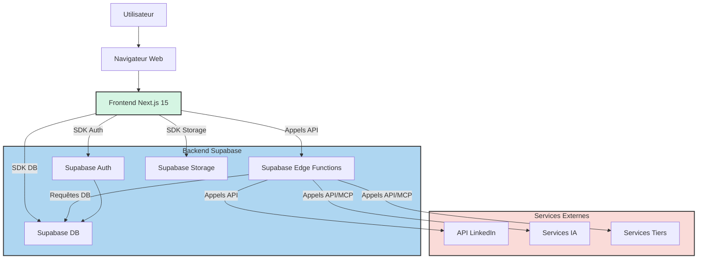

# System Architecture Overview

## Project Information

- **Project Name:** Linked-Pedia
- **Version:** 1.0
- **Last Updated:** 22/05/2025

## Architecture Overview

L'architecture de Linked-Pedia est conçue comme une application web moderne et scalable, s'appuyant sur une approche hybride avec un frontend rendu côté client et serveur (Next.js) et un backend serverless (Supabase Edge Functions) pour la logique métier et les interactions externes. L'objectif est de fournir une expérience utilisateur rapide et réactive tout en gérant de manière sécurisée les interactions avec des services tiers comme l'API LinkedIn et les modèles d'IA.

Les principaux composants incluent le frontend Next.js, la suite backend de Supabase (Base de données PostgreSQL, Authentification, Stockage, Edge Functions) et diverses intégrations avec des services externes et des MCPs.

## System Components

### Frontend

- **Framework:** Next.js 15 (avec App Router, TypeScript)
- **Key Libraries:** React, Tailwind CSS, Shadcn/ui (personnalisé), librairies auxiliaires sélectionnées par l'Agent IA pour des besoins spécifiques (ex: gestion de formulaires, validation).
- **State Management:** Approche standard React/Next.js (Zustand, hooks) pour la gestion de l'état local et global.
- **UI Component Structure:** Suivra les principes de l'Atomic Design pour une meilleure organisation et réutilisabilité des composants.

### Backend

- **Framework:** Supabase Edge Functions (basées sur Deno et TypeScript)
- **API Design:** Approche RESTful pour les endpoints exposés par les Edge Functions.
- **Authentication:** Gérée par Supabase Auth. Les Edge Functions vérifieront l'authentification et les autorisations.
- **Key Services:**
  - Edge Functions : Exécutent la logique métier complexe, orchestrent les appels aux services externes (LinkedIn, IA) et interagissent avec la base de données Supabase.
  - Supabase Auth : Gère l'inscription, la connexion et la gestion des sessions utilisateur.
  - Supabase Storage : Gère le stockage des fichiers téléchargés par les utilisateurs.

### Database

- **Type:** Relationnelle
- **Technology:** Supabase Database (PostgreSQL)
- **Data Model:** Le modèle de données inclura des tables pour les utilisateurs, les comptes LinkedIn liés, les sous-comptes, les posts, les statistiques de posts et les audits de profil. Le schéma détaillé sera spécifié ultérieurement (voir PRD Section 5.5).
- **Scaling Strategy:** S'appuie sur la scalabilité gérée de Supabase PostgreSQL. L'optimisation des requêtes et l'utilisation d'index seront cruciales.

## Architecture Diagram

## Key Design Decisions

### Decision 1: Utilisation de Next.js 15 avec App Router

- **Context:** Nécessité d'une application web moderne, performante et scalable avec des capacités de rendu côté serveur et client.
- **Options Considered:** React (SPA), d'autres frameworks comme Vue ou Angular.
- **Decision:** Choisir Next.js 15 avec App Router.
- **Rationale:** Offre un excellent équilibre entre performance (rendu hybride), expérience développeur (convention basée sur les fichiers, API Routes, Edge Functions), et scalabilité. L'App Router apporte des améliorations significatives pour la gestion des routes et le rendu.
- **Consequences:** Nécessite une familiarisation avec les concepts spécifiques de Next.js 15 (Server Components, Client Components, Edge Functions).

### Decision 2: Adoption de Supabase comme Backend as a Service (BaaS)

- **Context:** Besoin d'une solution backend intégrée et gérée pour l'authentification, la base de données, le stockage et l'exécution de logique serverless, afin de réduire le temps de développement backend.
- **Options Considered:** Construire un backend personnalisé (Node.js/Express, Python/Django), utiliser d'autres BaaS (Firebase, AWS Amplify).
- **Decision:** Choisir Supabase.
- **Rationale:** Fournit une base de données PostgreSQL robuste, une solution d'authentification complète, un stockage de fichiers et des Edge Functions basées sur Deno, le tout dans une plateforme intégrée. S'aligne bien avec une stack JavaScript/TypeScript.
- **Consequences:** Dépendance à la plateforme Supabase. Nécessite de comprendre les concepts spécifiques de Supabase (RLS, Edge Functions).

### Decision 3: Centralisation des Interactions Externes dans les Edge Functions

- **Context:** Les interactions avec l'API LinkedIn et les services IA impliquent des clés API sensibles et une logique potentiellement complexe.
- **Options Considered:** Appeler les APIs externes directement depuis le frontend, utiliser un backend monolithique dédié.
- **Decision:** Centraliser les appels aux APIs externes et la logique sensible dans les Supabase Edge Functions.
- **Rationale:** Améliore la sécurité en protégeant les clés API côté serveur. Simplifie la logique frontend. Permet de gérer la complexité des appels API et le traitement des réponses dans un environnement contrôlé et scalable.
- **Consequences:** Augmente la complexité des Edge Functions. Nécessite une gestion rigoureuse des erreurs et des temps d'attente pour les appels externes.

### Decision 4: Utilisation de Tailwind CSS avec Personnalisation Shadcn/ui

- **Context:** Besoin d'un système de style rapide et flexible pour implémenter une interface utilisateur épurée et professionnelle, tout en visant une haute qualité de design.
- **Options Considered:** CSS Modules, Styled Components, d'autres frameworks UI (Material UI, Ant Design).
- **Decision:** Utiliser Tailwind CSS avec une personnalisation des composants inspirée par Shadcn/ui.
- **Rationale:** Tailwind permet un prototypage et une implémentation UI rapides grâce à ses classes utilitaires. L'approche Shadcn/ui fournit des composants accessibles et bien conçus qui peuvent être facilement personnalisés pour correspondre au Design System Linked-Pedia, assurant cohérence et qualité.
- **Consequences:** Courbe d'apprentissage initiale pour Tailwind si non familier. Nécessite une discipline pour maintenir la cohérence via le Design System personnalisé.

## Communication Patterns

- **Synchronous Communications:** Le frontend communique avec les Edge Functions Supabase via des appels API RESTful (HTTP/HTTPS). Le frontend interagit également avec les services Supabase (Auth, Database, Storage) via le SDK client Supabase, qui gère les communications sous-jacentes (HTTP/WebSockets). Les Edge Functions communiquent de manière synchrone avec l'API LinkedIn et les services IA externes via HTTP/HTTPS.
- **Asynchronous Communications:** Actuellement, pas de besoins identifiés pour des queues de messages ou des patterns événementiels complexes dans le MVP. Cela pourra être envisagé pour des fonctionnalités futures (ex: notifications en temps réel, traitements en arrière-plan).
- **Error Handling:** Une stratégie centralisée de gestion des erreurs sera mise en place dans les Edge Functions et le frontend pour intercepter, logger et présenter les erreurs de manière cohérente à l'utilisateur. Les erreurs provenant des APIs externes devront être gérées spécifiquement.

## Security Architecture

- **Authentication:** Gérée par Supabase Auth (basée sur JWT). Les utilisateurs s'inscrivent et se connectent via email/mot de passe ou potentiellement d'autres fournisseurs à l'avenir.
- **Authorization:** Mise en œuvre via les politiques Row Level Security (RLS) dans la base de données Supabase pour contrôler l'accès aux données au niveau des lignes. Les Edge Functions appliqueront également des contrôles d'autorisation basés sur le rôle ou l'identité de l'utilisateur.
- **Data Protection:** Les données sensibles (mots de passe, tokens LinkedIn) seront stockées de manière sécurisée (hachage pour les mots de passe, stockage chiffré pour les tokens si nécessaire). Toutes les communications seront chiffrées via HTTPS. Les politiques RLS garantiront que les utilisateurs n'accèdent qu'à leurs propres données ou à celles des sous-comptes qu'ils gèrent.
- **API Security:** Les Edge Functions seront protégées. La gestion des clés API pour les services externes se fera via les variables d'environnement sécurisées de Supabase. Validation et assainissement stricts de toutes les entrées utilisateur pour prévenir les injections et autres vulnérabilités.

## Scalability Considerations

- **Horizontal Scaling:** Next.js sur des plateformes comme Vercel scale horizontalement automatiquement. Supabase (Database, Auth, Storage, Edge Functions) est également conçu pour scaler horizontalement. Les Edge Functions seront développées pour être stateless afin de faciliter leur mise à l'échelle.
- **Vertical Scaling:** Moins pertinent avec une architecture serverless et BaaS, mais les ressources de la base de données Supabase peuvent être ajustées si nécessaire.
- **Caching Strategy:** Mise en œuvre du caching côté frontend (Next.js caching) et potentiellement côté backend pour les réponses fréquentes des services externes si les politiques le permettent.
- **Load Balancing:** Géré automatiquement par la plateforme d'hébergement (Vercel) et Supabase.

## Monitoring and Observability

- **Logging:** Utilisation des systèmes de logging fournis par Vercel (pour le frontend/serverless functions) et Supabase (pour la base de données et les Edge Functions). Mise en place d'un logging structuré pour faciliter l'analyse.
- **Metrics:** Suivi des métriques clés fournies par Vercel et Supabase (temps de réponse, taux d'erreur, utilisation des ressources). Définition de métriques applicatives spécifiques (ex: nombre de posts générés, nombre d'audits effectués).
- **Alerting:** Configuration d'alertes basées sur les métriques clés (ex: taux d'erreur élevé, latence accrue) pour être notifié rapidement des problèmes.
- **Tracing:** Exploration des options de tracing distribué si nécessaire pour débugger les flux complexes impliquant plusieurs Edge Functions et services externes.

## Future Considerations

L'architecture actuelle est conçue pour être extensible. Les Edge Functions permettent d'ajouter de nouvelles logiques métier et intégrations sans impacter le reste du système. L'ajout de nouvelles fonctionnalités (multi-plateforme, analyse concurrentielle) pourra nécessiter l'intégration de nouveaux services externes ou MCPs, qui seront gérés via les Edge Functions. Une évolution vers une architecture plus événementielle pourrait être envisagée si les besoins en communication asynchrone augmentent significativement. L'exploration de l'utilisation de la base de données Vectorielle de Supabase pour des fonctionnalités IA plus avancées est une possibilité future.

---

_This document should be updated whenever significant architectural decisions are made or when the architecture evolves._
