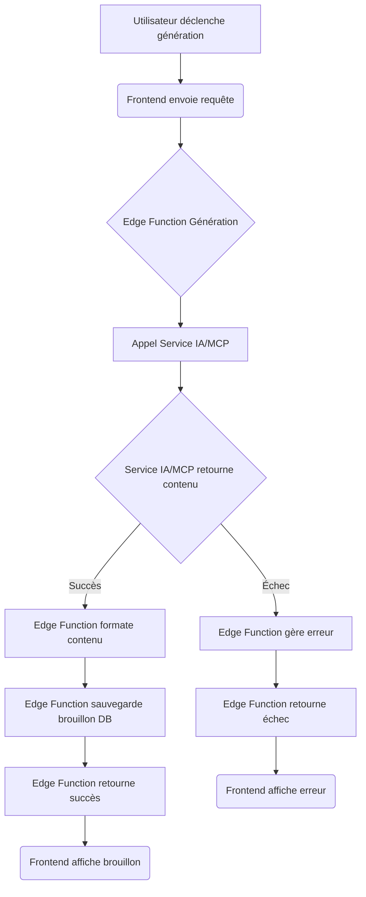

# Business Logic: Gestion de Contenu et Optimisation LinkedIn

## Overview

- **Domain:** Gestion de Contenu et Optimisation LinkedIn
- **Purpose:** Ce domaine couvre la logique métier liée à la création, l'optimisation, l'organisation, la publication et l'analyse du contenu LinkedIn des utilisateurs, ainsi que l'audit de leur profil.
- **Key Stakeholders:** Utilisateurs finaux (professionnels, ghostwriters), Agent de Codage IA, Agent de Conception IA.

## Core Concepts

### Concept 1: Post LinkedIn

- **Definition:** Une unité de contenu (texte, image, lien, document) destinée à être publiée sur le profil LinkedIn d'un utilisateur.
- **Attributes:** `id`, `user_id`, `linkedin_account_id`, `content` (texte formaté), `media` (liens/références vers images/docs/liens externes), `status` (brouillon, programmé, publié, échec), `scheduled_date`, `published_date`, `creation_date`, `update_date`, `type` (texte, image, vidéo, article, etc.), `category`, `axes`, `ai_suggestions_applied` (références aux suggestions IA utilisées), `linkedin_post_id` (URN LinkedIn après publication).
- **Relationships:** Lié à un `user` et potentiellement un `linkedin_account` (pour les sous-comptes). Peut avoir plusieurs `post_analytics` associés après publication.
- **Lifecycle:** Brouillon -> Programmé -> Publié OU Brouillon -> Publié immédiatement OU Brouillon -> Archivé/Supprimé. Peut passer à l'état 'échec' si la publication/programmation échoue.

### Concept 2: Audit de Profil

- **Definition:** Une analyse du profil LinkedIn d'un utilisateur pour évaluer sa complétude, sa performance potentielle et son alignement avec les meilleures pratiques et les objectifs de l'utilisateur.
- **Attributes:** `id`, `user_id`, `linkedin_account_id`, `audit_date`, `linkedin_ssi_score`, `sections_scores` (scores détaillés par section du profil), `recommendations` (liste de suggestions personnalisées), `status` (en cours, complété, échec).
- **Relationships:** Lié à un `user` et un `linkedin_account`.
- **Lifecycle:** En cours -> Complété OU En cours -> Échec.

### Concept 3: Suggestion IA

- **Definition:** Une proposition générée par l'intelligence artificielle pour aider l'utilisateur (ex: brouillon de post, optimisation de texte, idée de sujet, accroche, recommandation d'audit).
- **Attributes:** `id`, `type` (génération, optimisation, idée, accroche, recommandation audit), `source_content` (contenu analysé par l'IA), `generated_content` (proposition de l'IA), `parameters` (paramètres utilisés pour la génération), `feedback` (feedback utilisateur sur la suggestion), `related_post_id` (si lié à un post spécifique), `creation_date`.
- **Relationships:** Peut être lié à un `post` ou un `profile_audit`.

## Business Rules

### Rule 1: Limite de Sous-Comptes

- **Description:** Un utilisateur principal (payant) ne peut lier et gérer qu'un maximum de 3 sous-comptes LinkedIn.
- **Conditions:** Lors de la tentative d'ajout d'un nouveau sous-compte.
- **Actions:** Si le nombre de sous-comptes liés atteint déjà 3, refuser l'ajout et informer l'utilisateur de la limite.
- **Exceptions:** Aucune dans le cadre du MVP.
- **Validation:** Vérifier le nombre de sous-comptes associés à l'utilisateur principal avant de permettre l'ajout d'un nouveau.

### Rule 2: Programmation de Posts

- **Description:** Un post programmé doit avoir une date et une heure futures.
- **Conditions:** Lors de la programmation d'un post.
- **Actions:** Si la date ou l'heure est dans le passé, refuser la programmation et demander à l'utilisateur de choisir une date/heure future.
- **Exceptions:** Aucune.
- **Validation:** Valider que `scheduled_date` est postérieure à la date et heure actuelles.

### Rule 3: Accès aux Données

- **Description:** Un utilisateur ne peut accéder qu'à ses propres posts, audits de profil et sous-comptes, ainsi qu'aux posts et audits des sous-comptes qu'il gère.
- **Conditions:** Lors de toute requête d'accès ou de modification de données.
- **Actions:** Refuser l'accès ou la modification si l'utilisateur n'est pas le propriétaire des données ou le gestionnaire du sous-compte associé.
- **Exceptions:** Aucune.
- **Validation:** Implémenter des politiques Row Level Security (RLS) strictes dans la base de données Supabase et des contrôles d'autorisation dans les Edge Functions.

## Workflows

### Workflow 1: Génération et Sauvegarde d'un Brouillon de Post

- **Trigger:** L'utilisateur utilise une fonctionnalité de génération de post (texte, fichier, idée).
- **Actors:** Utilisateur, Frontend, Edge Function (Génération IA), Service(s) IA externe(s)/MCP(s).
- **Preconditions:** L'utilisateur est connecté.
- **Steps:**
  1. L'utilisateur fournit les paramètres de génération (thème, mots-clés, fichier/lien).
  2. Le Frontend envoie une requête à l'Edge Function de génération de post.
  3. L'Edge Function appelle le(s) service(s) IA externe(s)/MCP(s) avec les paramètres.
  4. Le(s) service(s) IA retourne(nt) le contenu généré.
  5. L'Edge Function reçoit le contenu, le formate si nécessaire.
  6. L'Edge Function crée un nouvel enregistrement dans la table `posts` avec le contenu généré et le statut 'brouillon'.
  7. L'Edge Function retourne la confirmation et les détails du brouillon créé au Frontend.
  8. Le Frontend affiche le brouillon à l'utilisateur.
- **Outcomes:** Un nouveau brouillon de post est créé dans la base de données et affiché à l'utilisateur.
- **Error Scenarios:** Échec de l'appel IA (réseau, erreur service), échec de la sauvegarde en base de données. Gérer les erreurs et informer l'utilisateur.

### Workflow 2: Programmation d'un Post

- **Trigger:** L'utilisateur choisit de programmer un brouillon de post.
- **Actors:** Utilisateur, Frontend, Edge Function (Programmation), Supabase Database.
- **Preconditions:** L'utilisateur est connecté, le post existe en tant que brouillon, une date et une heure futures sont spécifiées.
- **Steps:**
  1. L'utilisateur sélectionne un brouillon et spécifie une date/heure de programmation.
  2. Le Frontend envoie une requête à l'Edge Function de programmation.
  3. L'Edge Function valide la date/heure (doit être future).
  4. L'Edge Function met à jour l'enregistrement du post dans la table `posts`, changeant le statut à 'programmé' et enregistrant la `scheduled_date`.
  5. L'Edge Function retourne la confirmation au Frontend.
  6. Un mécanisme (ex: tâche planifiée Supabase Edge Function, ou service externe) surveille les posts 'programmés' et déclenche le workflow de publication (Workflow 3) à la `scheduled_date`.
- **Outcomes:** Le post est marqué comme 'programmé' avec la date spécifiée.
- **Error Scenarios:** Date/heure invalide, échec de la mise à jour en base de données.

## Calculations and Algorithms

### Calculation 1: Score d'Audit de Profil (Conceptuel)

- **Purpose:** Calculer un score global ou par section pour le profil LinkedIn de l'utilisateur, potentiellement basé sur le SSI LinkedIn et d'autres critères.
- **Inputs:** Données du profil LinkedIn de l'utilisateur (sections complétées, nombre de connexions, activité, etc.), potentiellement le score SSI officiel si accessible via l'API.
- **Formula/Algorithm:**
  1. Récupérer les données du profil via l'API LinkedIn.
  2. Si le SSI est accessible, l'utiliser comme base.
  3. Sinon, ou en complément, évaluer des critères mesurables : complétude du profil (photo, bannière, résumé, expérience, éducation, compétences), nombre de connexions, fréquence de publication, taux d'engagement moyen (si données disponibles).
  4. Appliquer une pondération à chaque critère pour obtenir un score global.
  5. Identifier les sections du profil qui contribuent le moins au score ou qui sont incomplètes.
- **Outputs:** Un score global (ex: sur 100), des scores par section, une liste de recommandations d'amélioration.
- **Edge Cases:** Profils très récents, profils avec peu d'activité, limitations de l'API LinkedIn sur les données accessibles.
- **Example:** Un profil sans résumé et avec peu de compétences listées aura un score plus bas dans les sections correspondantes et recevra des recommandations pour les compléter.

### Calculation 2: Taux d'Engagement

- **Purpose:** Calculer le taux d'engagement pour un post publié.
- **Inputs:** Nombre de likes, commentaires, partages, et impressions pour un post spécifique (obtenus via l'API LinkedIn).
- **Formula/Algorithm:** `Taux d'Engagement = ((Likes + Commentaires + Partages) / Impressions) * 100` (Formule courante, peut être ajustée).
- **Outputs:** Un pourcentage représentant le taux d'engagement.
- **Edge Cases:** Impressions nulles ou très faibles (peut donner un taux non représentatif ou une division par zéro). Gérer la division par zéro et noter les cas de faible impression.
- **Example:** Un post avec 1000 impressions, 20 likes, 5 commentaires, 2 partages aura un taux d'engagement de ((20+5+2)/1000)\*100 = 2.7%.

## Data Validation Rules

### Entity: User

| Field         | Validation Rules                                              | Error Messages                                 |
| ------------- | ------------------------------------------------------------- | ---------------------------------------------- |
| `email`       | Format email valide, unique.                                  | "Format email invalide", "Email déjà utilisé". |
| `password`    | Minimum 8 caractères, incluant majuscule, minuscule, chiffre. | "Mot de passe trop faible".                    |
| `linkedin_id` | Présent si compte LinkedIn lié.                               | "Compte LinkedIn non lié".                     |

### Entity: Post

| Field              | Validation Rules                              | Error Messages                               |
| ------------------ | --------------------------------------------- | -------------------------------------------- |
| `content`          | Non vide pour les posts texte.                | "Le contenu du post ne peut pas être vide".  |
| `scheduled_date`   | Doit être future si `status` est 'programmé'. | "La date de programmation doit être future". |
| `linkedin_post_id` | Présent si `status` est 'publié'.             | "ID LinkedIn manquant pour un post publié".  |

## Integration Points

- **API LinkedIn :** Point d'intégration majeur pour l'authentification, la publication, la programmation (déclenchement), la récupération des statistiques et des données de profil. Géré via les Edge Functions.
- **Services IA externes/MCPs :** Points d'intégration pour la génération et l'optimisation de contenu, potentiellement l'analyse de tendances. Géré via les Edge Functions utilisant l'outil `use_mcp_tool`.
- **Supabase Database :** Point d'intégration pour la persistance de toutes les données (utilisateurs, posts, audits, etc.). Interagi via le SDK Supabase (Frontend et Edge Functions) et les politiques RLS.
- **Supabase Storage :** Point d'intégration pour le stockage des fichiers téléchargés. Interagi via le SDK Supabase.

## Reporting Requirements

- **Rapport 1: Tableau de Bord des Posts :** Afficher la liste des posts avec leur statut (brouillon, programmé, publié), date, et pour les posts publiés, les métriques clés (impressions, engagement).
- **Rapport 2: Rapport d'Audit de Profil :** Présenter le score global et par section du profil LinkedIn, ainsi que la liste des recommandations personnalisées.
- **Rapport 3: Statistiques Détaillées d'un Post :** Afficher les métriques complètes et l'évolution dans le temps (si possible) pour un post sélectionné.

## Compliance and Regulatory Considerations

- **Respect des Politiques LinkedIn :** L'utilisation de l'API et des données doit être strictement conforme aux conditions d'utilisation et aux politiques de développeur de LinkedIn. Cela inclut la manière dont les données sont utilisées et stockées, et les actions effectuées au nom de l'utilisateur.
- **Protection des Données Utilisateur :** Bien qu'aucune réglementation spécifique n'ait été identifiée, les principes de base de la protection des données (collecte minimale, consentement, sécurité, droit d'accès/suppression) seront appliqués, en particulier pour les données sensibles comme les tokens LinkedIn.

## Known Edge Cases and Special Scenarios

- **Scénario 1: Token LinkedIn expiré ou invalide :** Si un appel API échoue en raison d'un token invalide, le système doit tenter de le rafraîchir. Si le rafraîchissement échoue, l'utilisateur doit être invité à reconnecter son compte LinkedIn.
- **Scénario 2: Échec de publication/programmation sur LinkedIn :** Si l'API LinkedIn retourne une erreur lors de la publication ou de la programmation, le statut du post dans Link-Pedia doit être mis à jour en 'échec' et l'utilisateur doit être notifié avec le message d'erreur si possible.
- **Scénario 3: Fichier soumis non supporté pour la génération de post :** Si l'utilisateur télécharge un type de fichier que l'IA ne peut pas traiter, l'application doit afficher un message d'erreur clair indiquant les formats supportés.
- **Scénario 4: Utilisateur déconnecte son compte LinkedIn :** Si l'utilisateur révoque l'accès de Link-Pedia depuis LinkedIn, l'application doit détecter cela (via des erreurs API) et mettre à jour le statut de liaison du compte dans Link-Pedia, informant l'utilisateur que les fonctionnalités nécessitant l'accès ne sont plus disponibles.

## Implementation Considerations

- **Performance:** Optimiser les appels aux services externes (IA, LinkedIn) pour minimiser la latence. Utiliser des requêtes asynchrones dans les Edge Functions. Optimiser les requêtes de base de données.
- **Scalability:** Concevoir les Edge Functions pour être stateless. S'assurer que les services IA et l'API LinkedIn peuvent supporter la charge attendue.
- **Security:** Gérer les secrets (clés API, tokens) de manière sécurisée. Implémenter RLS. Valider les entrées.

---

_This document should be updated whenever business rules or workflows change._
