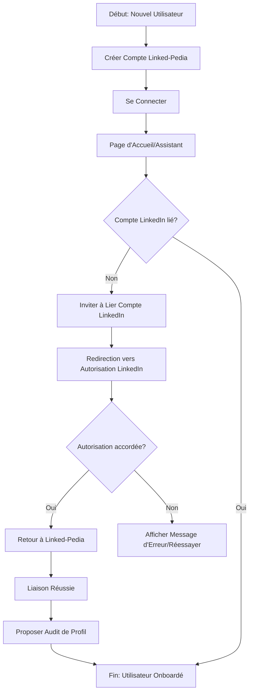

# Analyse Complète de l'Application Linked-Pedia

Ce document présente une analyse approfondie de l'application web Linked-Pedia, basée sur les documents de conception et les spécifications de fonctionnalités fournis.

## 1. Vision et Objectifs

**Vision du Produit :** Devenir la plateforme de référence pour les professionnels souhaitant maximiser leur influence et leurs opportunités sur LinkedIn, en offrant des outils IA de pointe qui transforment la manière dont ils créent, gèrent et optimisent leur contenu et leur profil.

**Problème Principal Résolu :** Les professionnels ont du mal à créer du contenu LinkedIn pertinent et engageant de manière efficace, à organiser leur activité de publication et à comprendre comment optimiser leur profil pour atteindre leurs objectifs.

**Objectifs Commerciaux (MVP) :**

- Acquérir 1000 utilisateurs actifs mensuels (MAU) dans les 6 mois.
- Atteindre un taux de conversion de 5% Freemium -> Payant dans les 6 mois.
- Démontrer une augmentation moyenne de 15% du taux d'engagement sur les posts publiés via Linked-Pedia dans les 3 mois.

## 2. Analyse du Marché et Utilisateurs

**Marché Cible :** Professionnels (indépendants, employés, entrepreneurs) cherchant à améliorer leur visibilité, leur influence et leur réseau sur LinkedIn.

**Segments d'Utilisateurs :**

- **Primaire :** Professionnels actifs (Sarah Dubois, Consultante en Marketing Digital).
- **Secondaire :** Ghostwriters et agences (David Chen, Ghostwriter LinkedIn), Étudiants/Jeunes Diplômés.

**Paysage Concurrentiel :** Outils généralistes de gestion de réseaux sociaux (Hootsuite, Buffer), générateurs de texte IA (Jasper, Copy.ai), outils d'automatisation LinkedIn (Waalaxy - attention aux politiques), services de ghostwriting.

**Proposition de Valeur Unique (UVP) :** Linked-Pedia est le copilote IA tout-en-un spécifiquement conçu pour LinkedIn, offrant une suite intégrée d'outils IA (génération, optimisation, analyse) et un audit de profil unique, permettant de gagner en visibilité et en influence sans effort.

## 3. Exigences Fonctionnelles (MVP)

Le périmètre initial inclut les fonctionnalités clés suivantes :

- Inscription et Connexion (FEAT-001)
- Liaison Compte LinkedIn (FEAT-002)
- Audit de Profil LinkedIn (FEAT-003)
- Générateur de Posts Texte (FEAT-004)
- Générateur de Posts à partir de Fichier/Lien (FEAT-005)
- Générateur d'Idées de Posts (FEAT-006)
- Optimiseur de Posts (FEAT-007)
- Générateur d'Accroches (FEAT-008)
- Tableau de Bord des Posts (FEAT-009)
- Programmation de Posts (FEAT-010)
- Statistiques de Performance (FEAT-011)
- Conseils Personnalisés (FEAT-012)
- Gestion des Sous-Comptes (jusqu'à 3) (FEAT-013)
- Mode Assistant (FEAT-014)
- Gestion du Profil Utilisateur (FEAT-015)

## 4. Exigences Non-Fonctionnelles (NFRs)

- **Performance :** Web Vitals 'Good', API < 500ms, génération IA < 5s (si possible), chargement rapide du tableau de bord.
- **Scalabilité :** Gérer 1000 utilisateurs concurrents, architecture permettant l'ajout futur de fonctionnalités.
- **Sécurité :** HTTPS, RLS Supabase, gestion sécurisée des tokens LinkedIn, protection OWASP Top 10, validation des entrées.
- **Fiabilité et Disponibilité :** Cible 99.9% uptime, gestion des erreurs, sauvegardes automatiques, mécanismes de retry.
- **Maintenabilité :** Code clair (TypeScript, conventions), documentation (TSDoc, Storybook), design modulaire.
- **Utilisabilité et Accessibilité :** UX/UI de haute qualité ("Silicon Valley / Y Combinator"), WCAG 2.1 AA, design réactif, navigation clavier, lecteurs d'écran.
- **Compatibilité :** Dernières versions des navigateurs majeurs, responsive design.
- **Conformité Réglementaire :** Principes de base de protection des données appliqués.
- **Documentation :** PRD, documentation code, Storybook, documentation API, conventions de design, spécifications de fonctionnalités.

## 5. Architecture et Conception

**Stack Technologique :**

- **Frontend :** Next.js 15 (App Router, TypeScript)
- **Backend/Database :** Supabase (PostgreSQL, Auth, Storage, Edge Functions)
- **Styling :** Tailwind CSS (avec Linked-Pedia Design System basé sur Shadcn/ui)
- **Langage :** TypeScript

**Principes Clés de Conception :** Clarté et Minimalisme, Intuitivité, Professionnalisme et Confiance, Réactivité et Fluidité, Accessibilité, Cohérence.

**Architecture Système Proposée (Mermaid Diagram) :**

```mermaid
graph TD
    A[Utilisateur] --> B(Navigateur Web);
    B --> C[Frontend Next.js 15];
    C --> |Appels API| D[Supabase Edge Functions];
    C --> |SDK Auth| E[Supabase Auth];
    C --> |SDK DB| F[Supabase Database (PostgreSQL)];
    C --> |SDK Storage| G[Supabase Storage];
    D --> |Requêtes DB| F;
    D --> |Appels API| H[API LinkedIn];
    D --> |Appels API/MCP| I[Services IA (Génération, Optimisation, Tendances)];
    D --> |Appels API/MCP| J[Autres Services Tiers/MCPs];
    E --> F;

    subgraph Backend (Supabase)
        D; E; F; G
    end

    subgraph Services Externes
        H; I; J
    end

    style C fill:#D5F5E3,stroke:#333,stroke-width:2px
    style Backend fill:#AED6F1,stroke:#333,stroke-width:2px
    style Services Externes fill:#FADBD8,stroke:#333,stroke-width:2px
```

**Description :** Le Frontend Next.js interagit avec Supabase (Auth, DB, Storage) via SDKs et avec les Edge Functions pour la logique métier complexe et les appels aux services externes (API LinkedIn, Services IA, autres MCPs/Tiers).

## 6. Modèle de Données (Inféré)

Basé sur les spécifications, le modèle de données PostgreSQL (Supabase) inclura les tables principales suivantes :

- **`auth.users`** : Gérée par Supabase Auth (ID, email, mot de passe haché, etc.).
- **`public.users`** : Informations utilisateur spécifiques à Linked-Pedia.
  - `id` (UUID, PK, FK vers `auth.users.id`)
  - `email` (TEXT, Unique)
  - `created_at`, `updated_at` (TIMESTAMP)
  - `preferences` (JSONB)
  - `objectives` (JSONB)
  - `activity_info` (JSONB)
  - `linkedin_account_linked` (BOOLEAN)
  - `assistant_status` (JSONB)
- **`public.linkedin_accounts`** : Informations et tokens des comptes LinkedIn liés.
  - `id` (UUID, PK)
  - `user_id` (UUID, FK vers `public.users.id`)
  - `linkedin_profile_id` (TEXT)
  - `access_token` (TEXT, chiffré)
  - `refresh_token` (TEXT, chiffré)
  - `expires_at`, `refresh_token_expires_at` (TIMESTAMP)
  - `scopes` (TEXT[])
  - `created_at`, `updated_at` (TIMESTAMP)
  - `is_primary` (BOOLEAN)
  - `sub_account_id` (UUID, FK optionnelle vers `public.sub_accounts.id`)
- **`public.sub_accounts`** : Représente les sous-comptes pour la gestion multi-comptes.
  - `id` (UUID, PK)
  - `user_id` (UUID, FK vers `public.users.id`)
  - `name` (TEXT)
  - `created_at`, `updated_at` (TIMESTAMP)
- **`public.posts`** : Stocke les brouillons, programmés et publiés.
  - `id` (UUID, PK)
  - `user_id` (UUID, FK vers `public.users.id`)
  - `linkedin_account_id` (UUID, FK vers `public.linkedin_accounts.id`)
  - `content` (TEXT)
  - `status` (TEXT: 'brouillon', 'programmé', 'publié', 'échec')
  - `created_at`, `updated_at` (TIMESTAMP)
  - `scheduled_date` (TIMESTAMP, peut être null)
  - `published_date` (TIMESTAMP, peut être null)
  - `linkedin_post_id` (TEXT, ID du post sur LinkedIn après publication)
  - `metadata` (JSONB: type, catégorie, axes, etc.)
- **`public.profile_audits`** : Résultats des audits de profil.
  - `id` (UUID, PK)
  - `user_id` (UUID, FK vers `public.users.id`)
  - `linkedin_account_id` (UUID, FK vers `public.linkedin_accounts.id`)
  - `audit_date` (TIMESTAMP)
  - `linkedin_ssi_score` (INTEGER, peut être null)
  - `calculated_score` (INTEGER, peut être null)
  - `sections_scores` (JSONB)
  - `recommendations` (JSONB)
  - `raw_profile_data` (JSONB, à évaluer)
  - `status` (TEXT)
- **`public.post_analytics`** : Statistiques de performance des posts.
  - `id` (UUID, PK)
  - `post_id` (UUID, FK vers `public.posts.id`)
  - `impressions`, `likes`, `comments`, `shares` (INTEGER)
  - `retrieved_at` (TIMESTAMP)

**Relations Clés :**

- `auth.users` 1 -- 1 `public.users`
- `public.users` 1 -- \* `public.sub_accounts`
- `public.users` 1 -- \* `public.linkedin_accounts` (où `is_primary` est true)
- `public.sub_accounts` 1 -- 1 `public.linkedin_accounts` (où `sub_account_id` est non null)
- `public.linkedin_accounts` 1 -- \* `public.posts`
- `public.linkedin_accounts` 1 -- \* `public.profile_audits`
- `public.posts` 1 -- \* `public.post_analytics`

## 7. Flux et Interactions Clés

**Flux Utilisateur : Création et Programmation d'un Post (Mermaid Diagram) :**

```mermaid
graph TD
    A[Début: Utilisateur connecté] --> B{Choisir l'action};
    B --> C[Naviguer vers "Créer un Post"];
    C --> D{Méthode de génération?};
    D --> E[Générer Texte/Idée];
    D --> F[Générer à partir de Fichier];
    E --> G[Fournir Mots-clés/Thème];
    F --> H[Télécharger Fichier/Coller Lien];
    G --> I[IA génère Brouillon];
    H --> I;
    I --> J[Examiner Brouillon];
    J --> K{Besoin d'optimisation/accroche?};
    K -- Oui --> L[Utiliser Optimiseur/Générateur Accroches];
    L --> J;
    K -- Non --> M[Modifier Brouillon (Optionnel)];
    M --> N{Publier maintenant ou Programmer?};
    N -- Publier maintenant --> O[Publier sur LinkedIn];
    N -- Programmer --> P[Choisir Date/Heure];
    P --> Q[Programmer sur LinkedIn];
    O --> R[Fin: Post Publié];
    Q --> R;
```

**Flux Utilisateur : Onboarding et Liaison LinkedIn (Mermaid Diagram) :**



D'autres flux sont décrits dans les spécifications de fonctionnalités, détaillant les interactions pour l'audit, les statistiques, la gestion des sous-comptes, etc.

## 8. Intégrations Tiers et MCPs

- **API LinkedIn :** Intégration majeure pour l'authentification (OAuth 2.0), la publication/programmation de posts, la récupération des statistiques et des données de profil.
- **Services IA / MCPs :** Utilisation de services externes ou de MCPs pour la génération de texte (FEAT-004, FEAT-005, FEAT-006, FEAT-008), l'optimisation de texte (FEAT-007), l'analyse de données utilisateur et la génération de conseils (FEAT-012), et potentiellement l'analyse de tendances ou l'extraction de contenu (FEAT-005, FEAT-008). Le MCP `hdw` est identifié comme potentiellement utile.
- **Supabase :** Utilisé comme backend tout-en-un (Auth, Database, Storage, Edge Functions).
- **Mécanisme de Déclenchement Programmé :** Nécessaire pour la publication des posts programmés (FEAT-010), potentiellement géré par Supabase Scheduled Edge Functions ou un service externe.

## 9. Risques et Dépendances

**Risques Clés :**

- Dépendance et limitations de l'API LinkedIn.
- Qualité insuffisante ou non-pertinence des suggestions générées par l'IA.
- Difficulté à établir la confiance des utilisateurs pour l'accès à leur compte LinkedIn.
- Concurrence accrue.

**Plan d'Atténuation :** Suivi API LinkedIn, utilisation de modèles IA de pointe avec feedback utilisateur, mise en avant de la sécurité et transparence, innovation continue, focus sur l'UVP.

**Dépendances :** API LinkedIn, Services IA/MCPs, Plateforme d'hébergement (Vercel), Services Supabase. Dépendances internes : Design System, spécifications détaillées, processus de validation utilisateur.

## 10. Conclusion

Linked-Pedia est une application ambitieuse visant à résoudre des problèmes concrets pour les professionnels sur LinkedIn en tirant parti de l'IA et d'une intégration poussée avec la plateforme. L'architecture proposée avec Next.js et Supabase semble adaptée pour un MVP scalable. Les spécifications de fonctionnalités détaillent bien les besoins, mais soulignent également des points ouverts, notamment le choix précis des services IA/MCPs et les détails d'implémentation de certains algorithmes (audit, conseils). La gestion sécurisée des données LinkedIn et la fiabilité du mécanisme de programmation sont des aspects techniques critiques. Le succès dépendra de la qualité de l'intégration LinkedIn, de la pertinence de l'IA et de l'expérience utilisateur globale.
