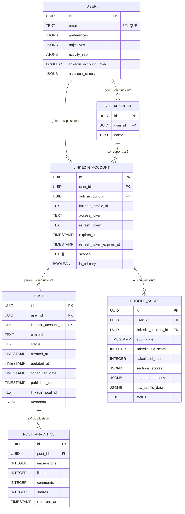

# Modèle Entité-Relation (Conceptualisation) - Linked-Pedia

Ce document présente le modèle Entité-Relation conceptuel pour l'application Linked-Pedia, basé sur l'analyse des exigences et des spécifications de fonctionnalités. Il décrit les entités principales et les relations entre elles.

## 1. Diagramme Entité-Relation (Mermaid)

Ce diagramme visualise les entités et leurs relations.

_Note : Le lien entre USER et LINKEDIN_ACCOUNT est 1-à-plusieurs, mais un seul compte est primaire (`is_primary`). Les sous-comptes (`SUB_ACCOUNT`) sont une abstraction pour regrouper des `LINKEDIN_ACCOUNT` supplémentaires sous un `USER` principal._

## 2. Description des Entités

- **USER :** Représente un utilisateur de l'application Linked-Pedia. Contient les informations de base et les préférences/objectifs pour la personnalisation.
- **LINKEDIN_ACCOUNT :** Représente un profil LinkedIn lié à un utilisateur Linked-Pedia. Stocke les tokens d'accès et les informations nécessaires pour interagir avec l'API LinkedIn. Un utilisateur principal a un compte LinkedIn primaire, et potentiellement plusieurs sous-comptes liés via la table SUB_ACCOUNT.
- **SUB_ACCOUNT :** Représente un sous-compte géré par un utilisateur principal (pour les ghostwriters). Permet de lier plusieurs profils LinkedIn (via LINKEDIN_ACCOUNT) à un seul utilisateur Linked-Pedia.
- **POST :** Représente un post créé ou géré dans Linked-Pedia. Peut être un brouillon, programmé ou publié. Stocke le contenu, le statut, les dates et les métadonnées.
- **PROFILE_AUDIT :** Stocke les résultats des audits de profil LinkedIn effectués pour un compte LinkedIn lié.
- **POST_ANALYTICS :** Stocke les statistiques de performance récupérées de LinkedIn pour un post publié spécifique.

## 3. Description des Relations

- **USER - LINKEDIN_ACCOUNT :** Un utilisateur peut gérer un ou plusieurs comptes LinkedIn (un principal et des sous-comptes).
- **USER - SUB_ACCOUNT :** Un utilisateur (principal) peut avoir zéro ou plusieurs sous-comptes.
- **SUB_ACCOUNT - LINKEDIN_ACCOUNT :** Chaque sous-compte correspond à exactement un compte LinkedIn lié (qui n'est pas le compte primaire de l'utilisateur principal).
- **LINKEDIN_ACCOUNT - POST :** Un compte LinkedIn peut avoir zéro ou plusieurs posts associés (créés, programmés, publiés via ce compte).
- **LINKEDIN_ACCOUNT - PROFILE_AUDIT :** Un compte LinkedIn peut avoir zéro ou plusieurs rapports d'audit de profil.
- **POST - POST_ANALYTICS :** Un post publié peut avoir zéro ou plusieurs enregistrements de statistiques (représentant les données récupérées à différents moments).

Ce modèle conceptuel sert de base pour la conception du schéma de base de données physique dans Supabase (PostgreSQL).
