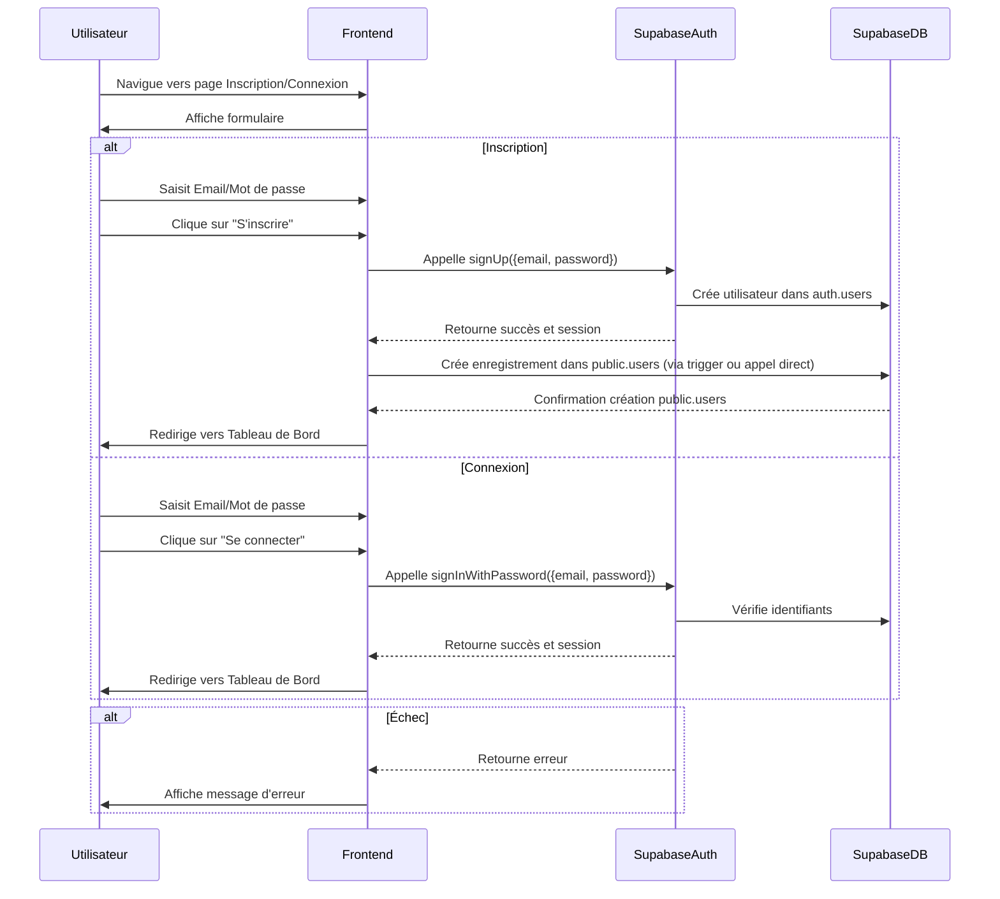

# Diagramme de Séquences : Inscription et Connexion (FEAT-001)

Ce diagramme décrit le processus d'inscription et de connexion d'un utilisateur à Linked-Pedia, en utilisant Supabase Auth.

```mermaid
sequenceDiagram
    participant Utilisateur
    participant Frontend
    participant SupabaseAuth
    participant SupabaseDB

    Utilisateur->>Frontend: Navigue vers page Inscription/Connexion
    Frontend->>Utilisateur: Affiche formulaire

    alt Inscription
        Utilisateur->>Frontend: Saisit Email/Mot de passe
        Utilisateur->>Frontend: Clique sur "S'inscrire"
        Frontend->>SupabaseAuth: Appelle signUp({email, password})
        SupabaseAuth->>SupabaseDB: Crée utilisateur dans auth.users
        SupabaseAuth-->>Frontend: Retourne succès et session
        Frontend->>SupabaseDB: Crée enregistrement dans public.users (via trigger ou appel direct)
        SupabaseDB-->>Frontend: Confirmation création public.users
        Frontend->>Utilisateur: Redirige vers Tableau de Bord
    else Connexion
        Utilisateur->>Frontend: Saisit Email/Mot de passe
        Utilisateur->>Frontend: Clique sur "Se connecter"
        Frontend->>SupabaseAuth: Appelle signInWithPassword({email, password})
        SupabaseAuth->>SupabaseDB: Vérifie identifiants
        SupabaseAuth-->>Frontend: Retourne succès et session
        Frontend->>Utilisateur: Redirige vers Tableau de Bord
    end

    alt Échec
        SupabaseAuth-->>Frontend: Retourne erreur
        Frontend->>Utilisateur: Affiche message d'erreur
    end
```
