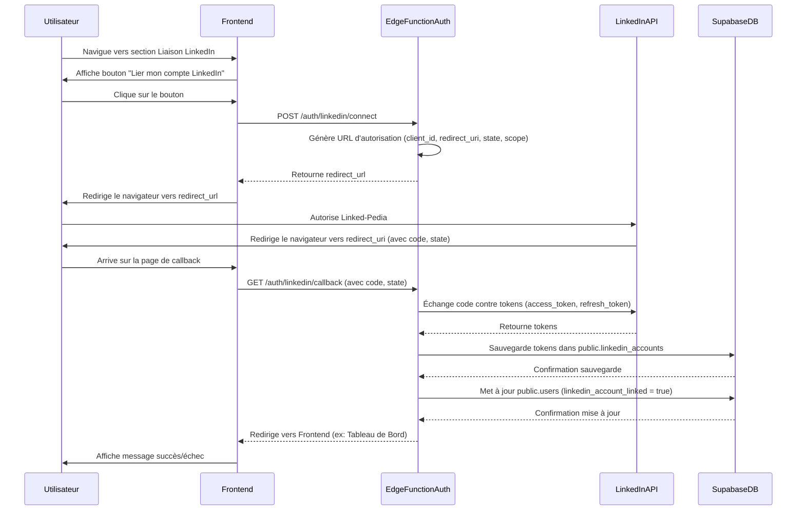

# Diagramme de Séquences : Liaison Compte LinkedIn (FEAT-002)

Ce diagramme décrit le processus de liaison d'un compte LinkedIn via OAuth 2.0.

```mermaid
sequenceDiagram
    participant Utilisateur
    participant Frontend
    participant EdgeFunctionAuth
    participant LinkedInAPI
    participant SupabaseDB

    Utilisateur->>Frontend: Navigue vers section Liaison LinkedIn
    Frontend->>Utilisateur: Affiche bouton "Lier mon compte LinkedIn"
    Utilisateur->>Frontend: Clique sur le bouton
    Frontend->>EdgeFunctionAuth: POST /auth/linkedin/connect
    EdgeFunctionAuth->>EdgeFunctionAuth: Génère URL d'autorisation (client_id, redirect_uri, state, scope)
    EdgeFunctionAuth-->>Frontend: Retourne redirect_url
    Frontend->>Utilisateur: Redirige le navigateur vers redirect_url
    Utilisateur->>LinkedInAPI: Autorise Linked-Pedia
    LinkedInAPI->>Utilisateur: Redirige le navigateur vers redirect_uri (avec code, state)
    Utilisateur->>Frontend: Arrive sur la page de callback
    Frontend->>EdgeFunctionAuth: GET /auth/linkedin/callback (avec code, state)
    EdgeFunctionAuth->>LinkedInAPI: Échange code contre tokens (access_token, refresh_token)
    LinkedInAPI-->>EdgeFunctionAuth: Retourne tokens
    EdgeFunctionAuth->>SupabaseDB: Sauvegarde tokens dans public.linkedin_accounts
    SupabaseDB-->>EdgeFunctionAuth: Confirmation sauvegarde
    EdgeFunctionAuth->>SupabaseDB: Met à jour public.users (linkedin_account_linked = true)
    SupabaseDB-->>EdgeFunctionAuth: Confirmation mise à jour
    EdgeFunctionAuth-->>Frontend: Redirige vers Frontend (ex: Tableau de Bord)
    Frontend->>Utilisateur: Affiche message succès/échec
```
