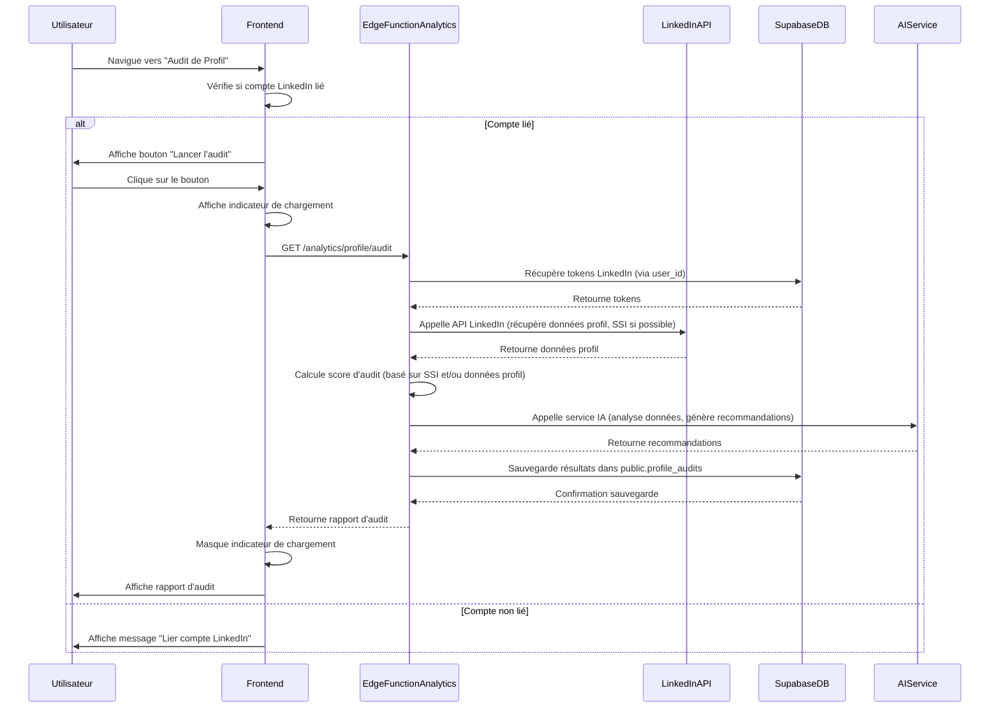

# Diagramme de Séquences : Audit de Profil LinkedIn (FEAT-003)

Ce diagramme décrit le processus d'audit d'un profil LinkedIn.

```mermaid
sequenceDiagram
    participant Utilisateur
    participant Frontend
    participant EdgeFunctionAnalytics
    participant LinkedInAPI
    participant SupabaseDB
    participant AIService

    Utilisateur->>Frontend: Navigue vers "Audit de Profil"
    Frontend->>Frontend: Vérifie si compte LinkedIn lié
    alt Compte lié
        Frontend->>Utilisateur: Affiche bouton "Lancer l'audit"
        Utilisateur->>Frontend: Clique sur le bouton
        Frontend->>Frontend: Affiche indicateur de chargement
        Frontend->>EdgeFunctionAnalytics: GET /analytics/profile/audit
        EdgeFunctionAnalytics->>SupabaseDB: Récupère tokens LinkedIn (via user_id)
        SupabaseDB-->>EdgeFunctionAnalytics: Retourne tokens
        EdgeFunctionAnalytics->>LinkedInAPI: Appelle API LinkedIn (récupère données profil, SSI si possible)
        LinkedInAPI-->>EdgeFunctionAnalytics: Retourne données profil
        EdgeFunctionAnalytics->>EdgeFunctionAnalytics: Calcule score d'audit (basé sur SSI et/ou données profil)
        EdgeFunctionAnalytics->>AIService: Appelle service IA (analyse données, génère recommandations)
        AIService-->>EdgeFunctionAnalytics: Retourne recommandations
        EdgeFunctionAnalytics->>SupabaseDB: Sauvegarde résultats dans public.profile_audits
        SupabaseDB-->>EdgeFunctionAnalytics: Confirmation sauvegarde
        EdgeFunctionAnalytics-->>Frontend: Retourne rapport d'audit
        Frontend->>Frontend: Masque indicateur de chargement
        Frontend->>Utilisateur: Affiche rapport d'audit
    else Compte non lié
        Frontend->>Utilisateur: Affiche message "Lier compte LinkedIn"
    end
```
