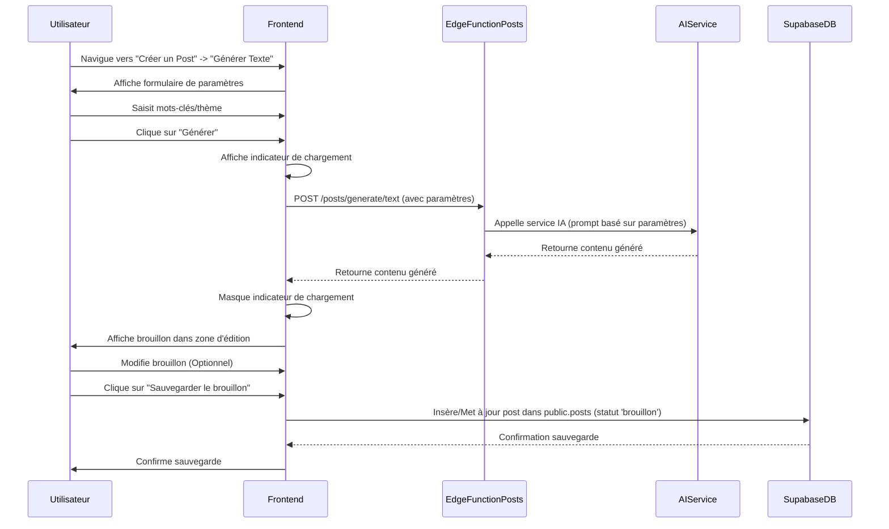

# Diagramme de Séquences : Générateur de Posts Texte (FEAT-004)

Ce diagramme décrit la génération d'un brouillon de post texte via un service IA.

```mermaid
sequenceDiagram
    participant Utilisateur
    participant Frontend
    participant EdgeFunctionPosts
    participant AIService
    participant SupabaseDB

    Utilisateur->>Frontend: Navigue vers "Créer un Post" -> "Générer Texte"
    Frontend->>Utilisateur: Affiche formulaire de paramètres
    Utilisateur->>Frontend: Saisit mots-clés/thème
    Utilisateur->>Frontend: Clique sur "Générer"
    Frontend->>Frontend: Affiche indicateur de chargement
    Frontend->>EdgeFunctionPosts: POST /posts/generate/text (avec paramètres)
    EdgeFunctionPosts->>AIService: Appelle service IA (prompt basé sur paramètres)
    AIService-->>EdgeFunctionPosts: Retourne contenu généré
    EdgeFunctionPosts-->>Frontend: Retourne contenu généré
    Frontend->>Frontend: Masque indicateur de chargement
    Frontend->>Utilisateur: Affiche brouillon dans zone d'édition
    Utilisateur->>Frontend: Modifie brouillon (Optionnel)
    Utilisateur->>Frontend: Clique sur "Sauvegarder le brouillon"
    Frontend->>SupabaseDB: Insère/Met à jour post dans public.posts (statut 'brouillon')
    SupabaseDB-->>Frontend: Confirmation sauvegarde
    Frontend->>Utilisateur: Confirme sauvegarde
```
