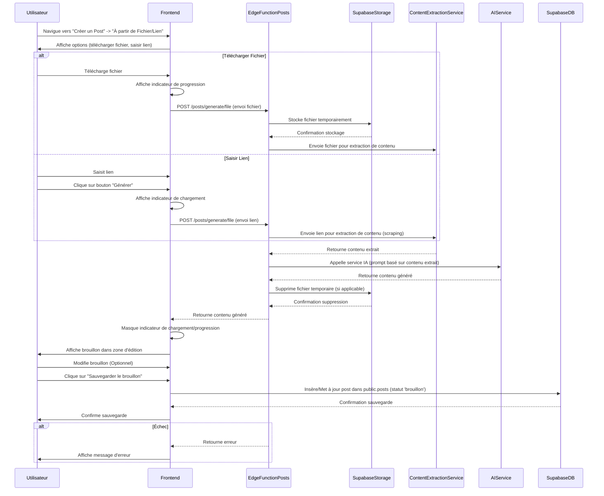

# Diagramme de Séquences : Générateur de Posts à partir de Fichier/Lien (FEAT-005)

Ce diagramme décrit le processus de génération d'un brouillon de post à partir d'un fichier téléchargé ou d'un lien fourni.

