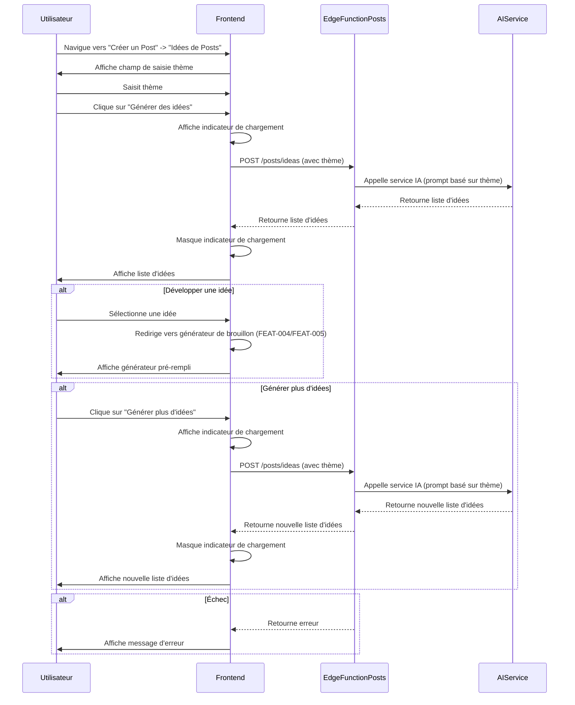

# Diagramme de Séquences : Générateur d'Idées de Posts (FEAT-006)

Ce diagramme décrit la génération d'idées de posts basées sur un thème via un service IA.

```mermaid
sequenceDiagram
    participant Utilisateur
    participant Frontend
    participant EdgeFunctionPosts
    participant AIService

    Utilisateur->>Frontend: Navigue vers "Créer un Post" -> "Idées de Posts"
    Frontend->>Utilisateur: Affiche champ de saisie thème
    Utilisateur->>Frontend: Saisit thème
    Utilisateur->>Frontend: Clique sur "Générer des idées"
    Frontend->>Frontend: Affiche indicateur de chargement
    Frontend->>EdgeFunctionPosts: POST /posts/ideas (avec thème)
    EdgeFunctionPosts->>AIService: Appelle service IA (prompt basé sur thème)
    AIService-->>EdgeFunctionPosts: Retourne liste d'idées
    EdgeFunctionPosts-->>Frontend: Retourne liste d'idées
    Frontend->>Frontend: Masque indicateur de chargement
    Frontend->>Utilisateur: Affiche liste d'idées
    alt Développer une idée
        Utilisateur->>Frontend: Sélectionne une idée
        Frontend->>Frontend: Redirige vers générateur de brouillon (FEAT-004/FEAT-005)
        Frontend->>Utilisateur: Affiche générateur pré-rempli
    end
    alt Générer plus d'idées
        Utilisateur->>Frontend: Clique sur "Générer plus d'idées"
        Frontend->>Frontend: Affiche indicateur de chargement
        Frontend->>EdgeFunctionPosts: POST /posts/ideas (avec thème)
        EdgeFunctionPosts->>AIService: Appelle service IA (prompt basé sur thème)
        AIService-->>EdgeFunctionPosts: Retourne nouvelle liste d'idées
        EdgeFunctionPosts-->>Frontend: Retourne nouvelle liste d'idées
        Frontend->>Frontend: Masque indicateur de chargement
        Frontend->>Utilisateur: Affiche nouvelle liste d'idées
    end

    alt Échec
        EdgeFunctionPosts-->>Frontend: Retourne erreur
        Frontend->>Utilisateur: Affiche message d'erreur
    end
```
