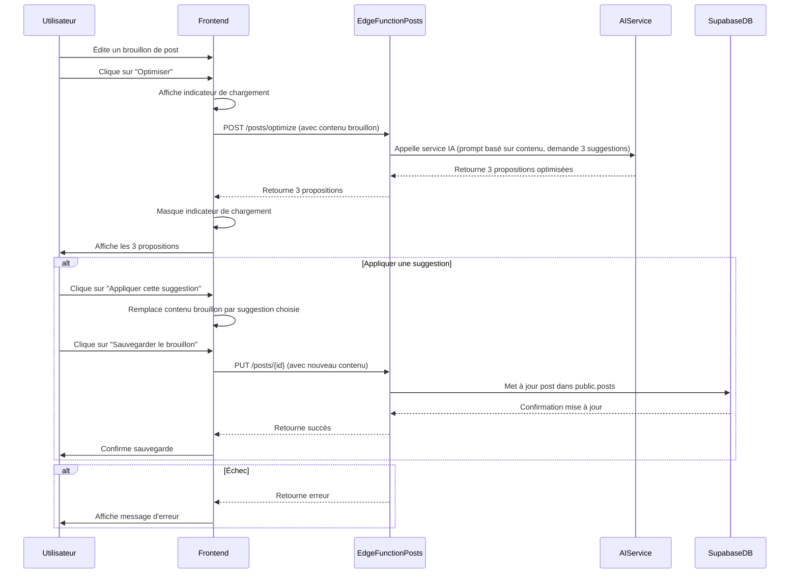

# Diagramme de Séquences : Optimiseur de Posts (FEAT-007)

Ce diagramme décrit le processus d'optimisation d'un brouillon de post via un service IA.

```mermaid
sequenceDiagram
    participant Utilisateur
    participant Frontend
    participant EdgeFunctionPosts
    participant AIService

    Utilisateur->>Frontend: Édite un brouillon de post
    Utilisateur->>Frontend: Clique sur "Optimiser"
    Frontend->>Frontend: Affiche indicateur de chargement
    Frontend->>EdgeFunctionPosts: POST /posts/optimize (avec contenu brouillon)
    EdgeFunctionPosts->>AIService: Appelle service IA (prompt basé sur contenu, demande 3 suggestions)
    AIService-->>EdgeFunctionPosts: Retourne 3 propositions optimisées
    EdgeFunctionPosts-->>Frontend: Retourne 3 propositions
    Frontend->>Frontend: Masque indicateur de chargement
    Frontend->>Utilisateur: Affiche les 3 propositions
    alt Appliquer une suggestion
        Utilisateur->>Frontend: Clique sur "Appliquer cette suggestion"
        Frontend->>Frontend: Remplace contenu brouillon par suggestion choisie
        Utilisateur->>Frontend: Clique sur "Sauvegarder le brouillon"
        Frontend->>EdgeFunctionPosts: PUT /posts/{id} (avec nouveau contenu)
        EdgeFunctionPosts->>SupabaseDB: Met à jour post dans public.posts
        SupabaseDB-->>EdgeFunctionPosts: Confirmation mise à jour
        EdgeFunctionPosts-->>Frontend: Retourne succès
        Frontend->>Utilisateur: Confirme sauvegarde
    end

    alt Échec
        EdgeFunctionPosts-->>Frontend: Retourne erreur
        Frontend->>Utilisateur: Affiche message d'erreur
    end
```
