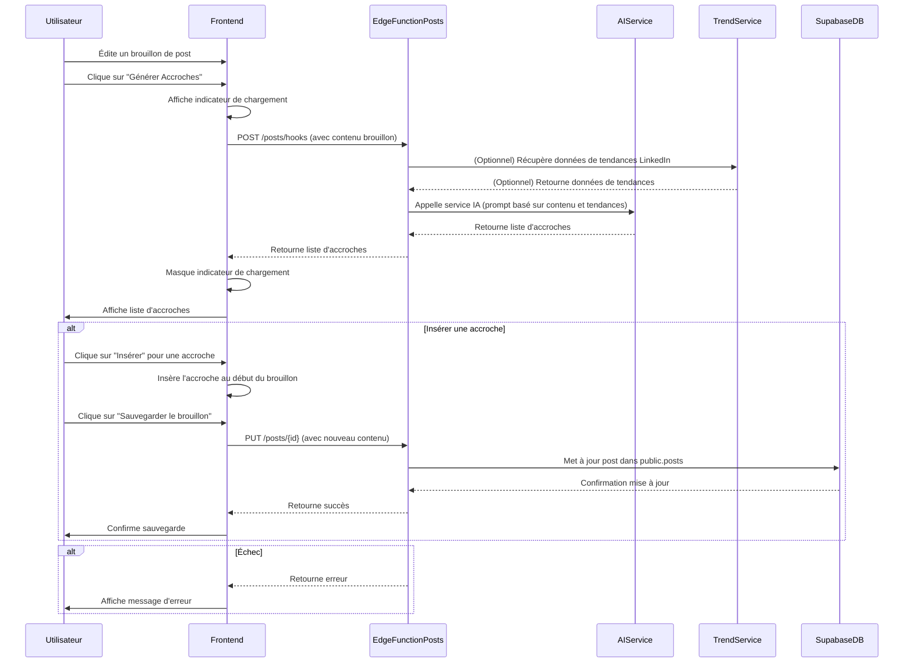

# Diagramme de Séquences : Générateur d'Accroches (FEAT-008)

Ce diagramme décrit le processus de génération de suggestions d'accroches pour un post via un service IA.

```mermaid
sequenceDiagram
    participant Utilisateur
    participant Frontend
    participant EdgeFunctionPosts
    participant AIService
    participant TrendService

    Utilisateur->>Frontend: Édite un brouillon de post
    Utilisateur->>Frontend: Clique sur "Générer Accroches"
    Frontend->>Frontend: Affiche indicateur de chargement
    Frontend->>EdgeFunctionPosts: POST /posts/hooks (avec contenu brouillon)
    EdgeFunctionPosts->>TrendService: (Optionnel) Récupère données de tendances LinkedIn
    TrendService-->>EdgeFunctionPosts: (Optionnel) Retourne données de tendances
    EdgeFunctionPosts->>AIService: Appelle service IA (prompt basé sur contenu et tendances)
    AIService-->>EdgeFunctionPosts: Retourne liste d'accroches
    EdgeFunctionPosts-->>Frontend: Retourne liste d'accroches
    Frontend->>Frontend: Masque indicateur de chargement
    Frontend->>Utilisateur: Affiche liste d'accroches
    alt Insérer une accroche
        Utilisateur->>Frontend: Clique sur "Insérer" pour une accroche
        Frontend->>Frontend: Insère l'accroche au début du brouillon
        Utilisateur->>Frontend: Clique sur "Sauvegarder le brouillon"
        Frontend->>EdgeFunctionPosts: PUT /posts/{id} (avec nouveau contenu)
        EdgeFunctionPosts->>SupabaseDB: Met à jour post dans public.posts
        SupabaseDB-->>EdgeFunctionPosts: Confirmation mise à jour
        EdgeFunctionPosts-->>Frontend: Retourne succès
        Frontend->>Utilisateur: Confirme sauvegarde
    end

    alt Échec
        EdgeFunctionPosts-->>Frontend: Retourne erreur
        Frontend->>Utilisateur: Affiche message d'erreur
    end
```
