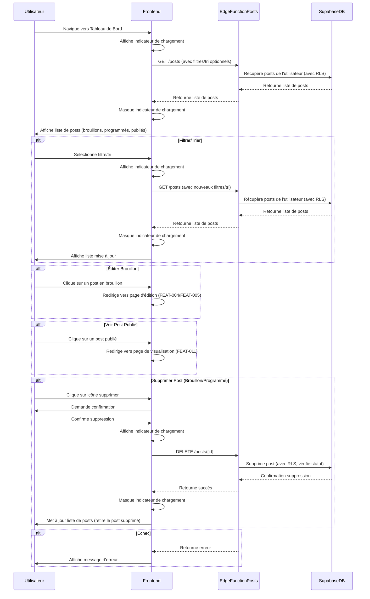

# Diagramme de Séquences : Tableau de Bord des Posts (FEAT-009)

Ce diagramme décrit l'affichage et la gestion des posts de l'utilisateur dans le tableau de bord.

```mermaid
sequenceDiagram
    participant Utilisateur
    participant Frontend
    participant EdgeFunctionPosts
    participant SupabaseDB

    Utilisateur->>Frontend: Navigue vers Tableau de Bord
    Frontend->>Frontend: Affiche indicateur de chargement
    Frontend->>EdgeFunctionPosts: GET /posts (avec filtres/tri optionnels)
    EdgeFunctionPosts->>SupabaseDB: Récupère posts de l'utilisateur (avec RLS)
    SupabaseDB-->>EdgeFunctionPosts: Retourne liste de posts
    EdgeFunctionPosts-->>Frontend: Retourne liste de posts
    Frontend->>Frontend: Masque indicateur de chargement
    Frontend->>Utilisateur: Affiche liste de posts (brouillons, programmés, publiés)

    alt Filtrer/Trier
        Utilisateur->>Frontend: Sélectionne filtre/tri
        Frontend->>Frontend: Affiche indicateur de chargement
        Frontend->>EdgeFunctionPosts: GET /posts (avec nouveaux filtres/tri)
        EdgeFunctionPosts->>SupabaseDB: Récupère posts de l'utilisateur (avec RLS)
        SupabaseDB-->>EdgeFunctionPosts: Retourne liste de posts
        EdgeFunctionPosts-->>Frontend: Retourne liste de posts
        Frontend->>Frontend: Masque indicateur de chargement
        Frontend->>Utilisateur: Affiche liste mise à jour
    end

    alt Éditer Brouillon
        Utilisateur->>Frontend: Clique sur un post en brouillon
        Frontend->>Frontend: Redirige vers page d'édition (FEAT-004/FEAT-005)
    end

    alt Voir Post Publié
        Utilisateur->>Frontend: Clique sur un post publié
        Frontend->>Frontend: Redirige vers page de visualisation (FEAT-011)
    end

    alt Supprimer Post (Brouillon/Programmé)
        Utilisateur->>Frontend: Clique sur icône supprimer
        Frontend->>Utilisateur: Demande confirmation
        Utilisateur->>Frontend: Confirme suppression
        Frontend->>Frontend: Affiche indicateur de chargement
        Frontend->>EdgeFunctionPosts: DELETE /posts/{id}
        EdgeFunctionPosts->>SupabaseDB: Supprime post (avec RLS, vérifie statut)
        SupabaseDB-->>EdgeFunctionPosts: Confirmation suppression
        EdgeFunctionPosts-->>Frontend: Retourne succès
        Frontend->>Frontend: Masque indicateur de chargement
        Frontend->>Utilisateur: Met à jour liste de posts (retire le post supprimé)
    end

    alt Échec
        EdgeFunctionPosts-->>Frontend: Retourne erreur
        Frontend->>Utilisateur: Affiche message d'erreur
    end
```
