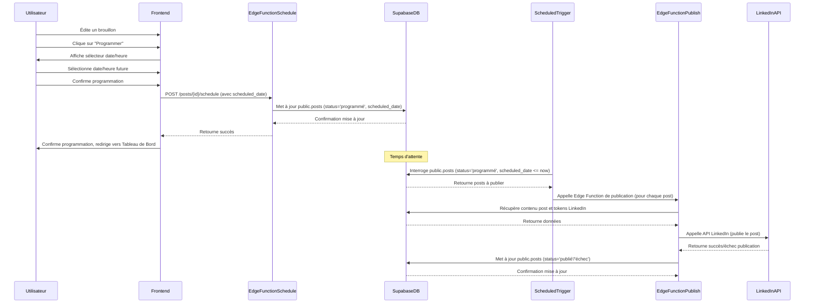

# Diagramme de Séquences : Programmation de Posts (FEAT-010)

Ce diagramme décrit la programmation d'un post et son déclenchement ultérieur.

```mermaid
sequenceDiagram
    participant Utilisateur
    participant Frontend
    participant EdgeFunctionSchedule
    participant SupabaseDB
    participant ScheduledTrigger
    participant EdgeFunctionPublish
    participant LinkedInAPI

    Utilisateur->>Frontend: Édite un brouillon
    Utilisateur->>Frontend: Clique sur "Programmer"
    Frontend->>Utilisateur: Affiche sélecteur date/heure
    Utilisateur->>Frontend: Sélectionne date/heure future
    Utilisateur->>Frontend: Confirme programmation
    Frontend->>EdgeFunctionSchedule: POST /posts/{id}/schedule (avec scheduled_date)
    EdgeFunctionSchedule->>SupabaseDB: Met à jour public.posts (status='programmé', scheduled_date)
    SupabaseDB-->>EdgeFunctionSchedule: Confirmation mise à jour
    EdgeFunctionSchedule-->>Frontend: Retourne succès
    Frontend->>Utilisateur: Confirme programmation, redirige vers Tableau de Bord
    Note over SupabaseDB: Temps d'attente
    ScheduledTrigger->>SupabaseDB: Interroge public.posts (status='programmé', scheduled_date <= now)
    SupabaseDB-->>ScheduledTrigger: Retourne posts à publier
    ScheduledTrigger->>EdgeFunctionPublish: Appelle Edge Function de publication (pour chaque post)
    EdgeFunctionPublish->>SupabaseDB: Récupère contenu post et tokens LinkedIn
    SupabaseDB-->>EdgeFunctionPublish: Retourne données
    EdgeFunctionPublish->>LinkedInAPI: Appelle API LinkedIn (publie le post)
    LinkedInAPI-->>EdgeFunctionPublish: Retourne succès/échec publication
    EdgeFunctionPublish->>SupabaseDB: Met à jour public.posts (status='publié'/'échec')
    SupabaseDB-->>EdgeFunctionPublish: Confirmation mise à jour
```
