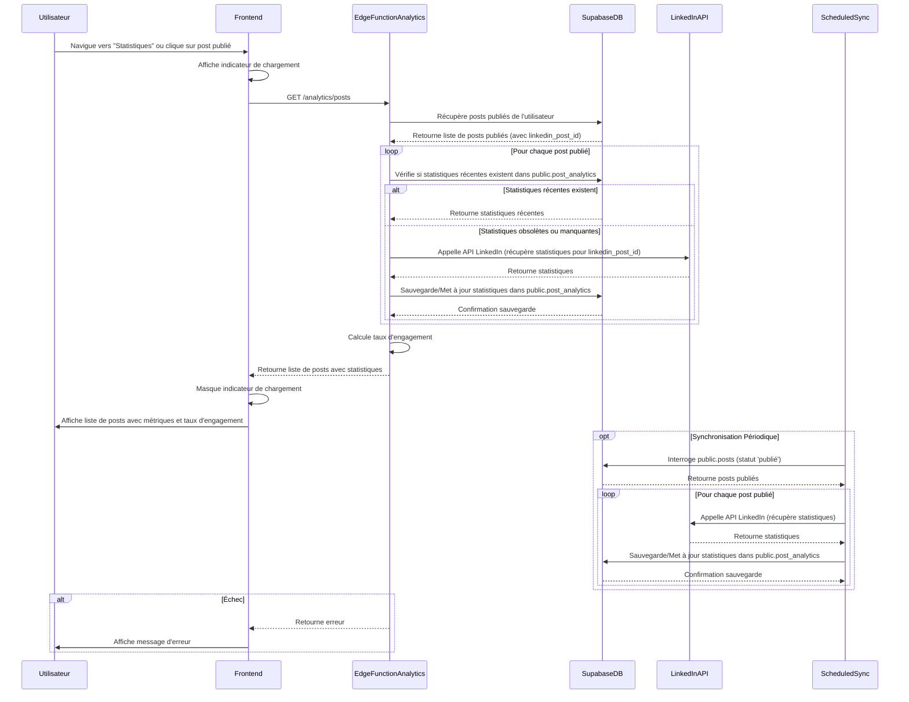

# Diagramme de Séquences : Statistiques de Performance (FEAT-011)

Ce diagramme décrit la récupération et l'affichage des statistiques de posts publiés.

```mermaid
sequenceDiagram
    participant Utilisateur
    participant Frontend
    participant EdgeFunctionAnalytics
    participant SupabaseDB
    participant LinkedInAPI
    participant ScheduledSync

    Utilisateur->>Frontend: Navigue vers "Statistiques" ou clique sur post publié
    Frontend->>Frontend: Affiche indicateur de chargement
    Frontend->>EdgeFunctionAnalytics: GET /analytics/posts
    EdgeFunctionAnalytics->>SupabaseDB: Récupère posts publiés de l'utilisateur
    SupabaseDB-->>EdgeFunctionAnalytics: Retourne liste de posts publiés (avec linkedin_post_id)

    loop Pour chaque post publié
        EdgeFunctionAnalytics->>SupabaseDB: Vérifie si statistiques récentes existent dans public.post_analytics
        alt Statistiques récentes existent
            SupabaseDB-->>EdgeFunctionAnalytics: Retourne statistiques récentes
        else Statistiques obsolètes ou manquantes
            EdgeFunctionAnalytics->>LinkedInAPI: Appelle API LinkedIn (récupère statistiques pour linkedin_post_id)
            LinkedInAPI-->>EdgeFunctionAnalytics: Retourne statistiques
            EdgeFunctionAnalytics->>SupabaseDB: Sauvegarde/Met à jour statistiques dans public.post_analytics
            SupabaseDB-->>EdgeFunctionAnalytics: Confirmation sauvegarde
        end
    end

    EdgeFunctionAnalytics->>EdgeFunctionAnalytics: Calcule taux d'engagement
    EdgeFunctionAnalytics-->>Frontend: Retourne liste de posts avec statistiques
    Frontend->>Frontend: Masque indicateur de chargement
    Frontend->>Utilisateur: Affiche liste de posts avec métriques et taux d'engagement

    opt Synchronisation Périodique
        ScheduledSync->>SupabaseDB: Interroge public.posts (statut 'publié')
        SupabaseDB-->>ScheduledSync: Retourne posts publiés
        loop Pour chaque post publié
            ScheduledSync->>LinkedInAPI: Appelle API LinkedIn (récupère statistiques)
            LinkedInAPI-->>ScheduledSync: Retourne statistiques
            ScheduledSync->>SupabaseDB: Sauvegarde/Met à jour statistiques dans public.post_analytics
            SupabaseDB-->>ScheduledSync: Confirmation sauvegarde
        end
    end

    alt Échec
        EdgeFunctionAnalytics-->>Frontend: Retourne erreur
        Frontend->>Utilisateur: Affiche message d'erreur
    end
```
