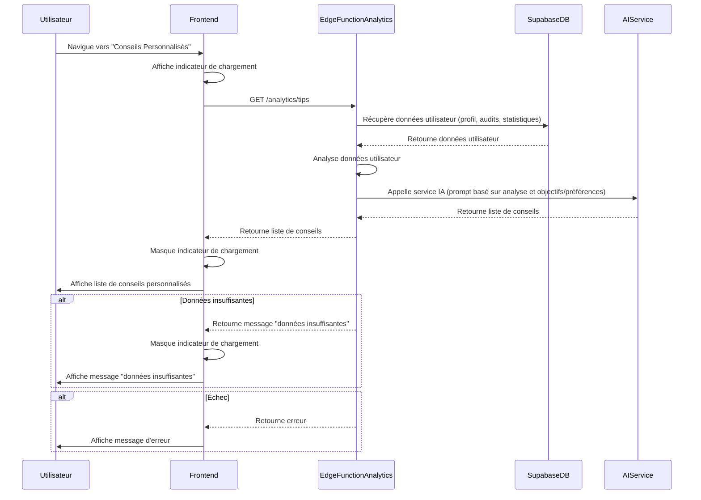

# Diagramme de Séquences : Conseils Personnalisés (FEAT-012)

Ce diagramme décrit la génération et l'affichage de conseils personnalisés basés sur les données utilisateur.

```mermaid
sequenceDiagram
    participant Utilisateur
    participant Frontend
    participant EdgeFunctionAnalytics
    participant SupabaseDB
    participant AIService

    Utilisateur->>Frontend: Navigue vers "Conseils Personnalisés"
    Frontend->>Frontend: Affiche indicateur de chargement
    Frontend->>EdgeFunctionAnalytics: GET /analytics/tips
    EdgeFunctionAnalytics->>SupabaseDB: Récupère données utilisateur (profil, audits, statistiques)
    SupabaseDB-->>EdgeFunctionAnalytics: Retourne données utilisateur
    EdgeFunctionAnalytics->>EdgeFunctionAnalytics: Analyse données utilisateur
    EdgeFunctionAnalytics->>AIService: Appelle service IA (prompt basé sur analyse et objectifs/préférences)
    AIService-->>EdgeFunctionAnalytics: Retourne liste de conseils
    EdgeFunctionAnalytics-->>Frontend: Retourne liste de conseils
    Frontend->>Frontend: Masque indicateur de chargement
    Frontend->>Utilisateur: Affiche liste de conseils personnalisés

    alt Données insuffisantes
        EdgeFunctionAnalytics-->>Frontend: Retourne message "données insuffisantes"
        Frontend->>Frontend: Masque indicateur de chargement
        Frontend->>Utilisateur: Affiche message "données insuffisantes"
    end

    alt Échec
        EdgeFunctionAnalytics-->>Frontend: Retourne erreur
        Frontend->>Utilisateur: Affiche message d'erreur
    end
```
