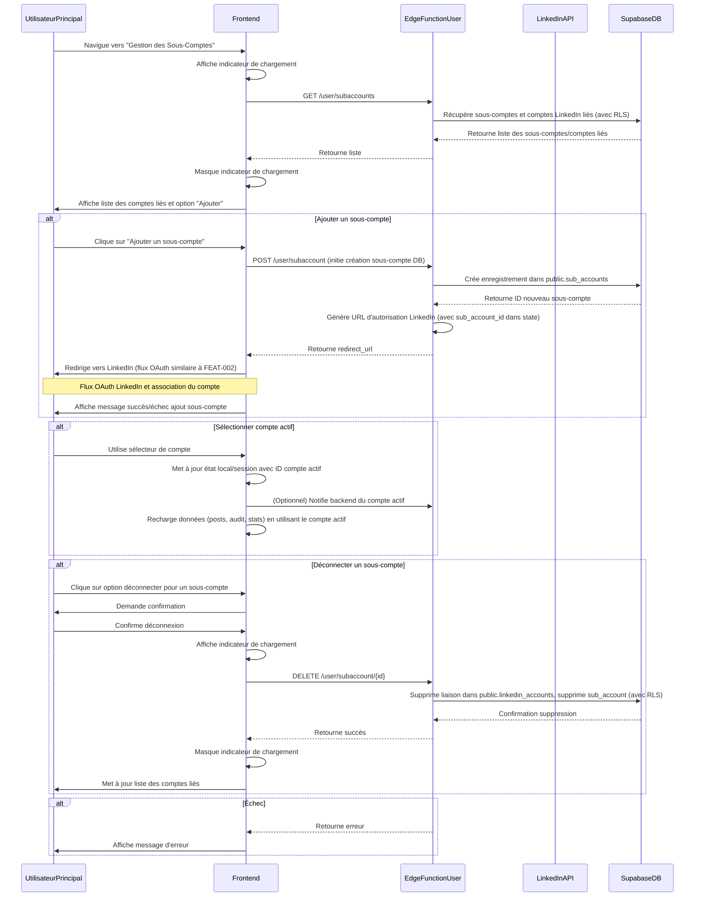

# Diagramme de Séquences : Gestion des Sous-Comptes (FEAT-013)

Ce diagramme décrit le processus d'ajout et de gestion des sous-comptes LinkedIn pour un utilisateur principal.

```mermaid
sequenceDiagram
    participant UtilisateurPrincipal
    participant Frontend
    participant EdgeFunctionUser
    participant LinkedInAPI
    participant SupabaseDB

    UtilisateurPrincipal->>Frontend: Navigue vers "Gestion des Sous-Comptes"
    Frontend->>Frontend: Affiche indicateur de chargement
    Frontend->>EdgeFunctionUser: GET /user/subaccounts
    EdgeFunctionUser->>SupabaseDB: Récupère sous-comptes et comptes LinkedIn liés (avec RLS)
    SupabaseDB-->>EdgeFunctionUser: Retourne liste des sous-comptes/comptes liés
    EdgeFunctionUser-->>Frontend: Retourne liste
    Frontend->>Frontend: Masque indicateur de chargement
    Frontend->>UtilisateurPrincipal: Affiche liste des comptes liés et option "Ajouter"

    alt Ajouter un sous-compte
        UtilisateurPrincipal->>Frontend: Clique sur "Ajouter un sous-compte"
        Frontend->>EdgeFunctionUser: POST /user/subaccount (initie création sous-compte DB)
        EdgeFunctionUser->>SupabaseDB: Crée enregistrement dans public.sub_accounts
        SupabaseDB-->>EdgeFunctionUser: Retourne ID nouveau sous-compte
        EdgeFunctionUser->>EdgeFunctionUser: Génère URL d'autorisation LinkedIn (avec sub_account_id dans state)
        EdgeFunctionUser-->>Frontend: Retourne redirect_url
        Frontend->>UtilisateurPrincipal: Redirige vers LinkedIn (flux OAuth similaire à FEAT-002)
        Note over Frontend,UtilisateurPrincipal: Flux OAuth LinkedIn et association du compte
        Frontend->>UtilisateurPrincipal: Affiche message succès/échec ajout sous-compte
    end

    alt Sélectionner compte actif
        UtilisateurPrincipal->>Frontend: Utilise sélecteur de compte
        Frontend->>Frontend: Met à jour état local/session avec ID compte actif
        Frontend->>EdgeFunctionUser: (Optionnel) Notifie backend du compte actif
        Frontend->>Frontend: Recharge données (posts, audit, stats) en utilisant le compte actif
    end

    alt Déconnecter un sous-compte
        UtilisateurPrincipal->>Frontend: Clique sur option déconnecter pour un sous-compte
        Frontend->>UtilisateurPrincipal: Demande confirmation
        UtilisateurPrincipal->>Frontend: Confirme déconnexion
        Frontend->>Frontend: Affiche indicateur de chargement
        Frontend->>EdgeFunctionUser: DELETE /user/subaccount/{id}
        EdgeFunctionUser->>SupabaseDB: Supprime liaison dans public.linkedin_accounts, supprime sub_account (avec RLS)
        SupabaseDB-->>EdgeFunctionUser: Confirmation suppression
        EdgeFunctionUser-->>Frontend: Retourne succès
        Frontend->>Frontend: Masque indicateur de chargement
        Frontend->>UtilisateurPrincipal: Met à jour liste des comptes liés
    end

    alt Échec
        EdgeFunctionUser-->>Frontend: Retourne erreur
        Frontend->>UtilisateurPrincipal: Affiche message d'erreur
    end
```
