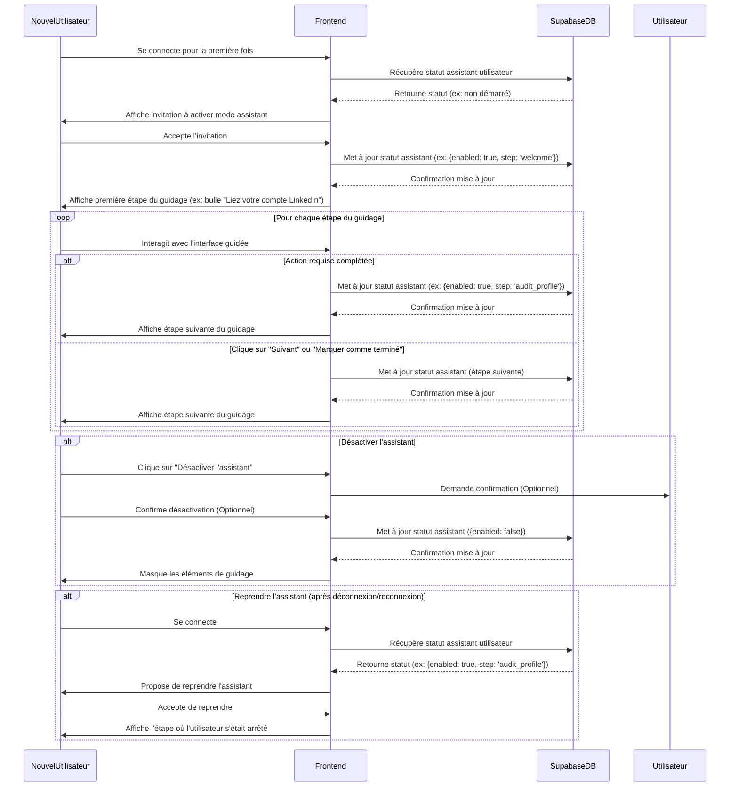

# Diagramme de Séquences : Mode Assistant (FEAT-014)

Ce diagramme décrit le flux du mode assistant pour guider les nouveaux utilisateurs.

```mermaid
sequenceDiagram
    participant NouvelUtilisateur
    participant Frontend
    participant SupabaseDB

    NouvelUtilisateur->>Frontend: Se connecte pour la première fois
    Frontend->>SupabaseDB: Récupère statut assistant utilisateur
    SupabaseDB-->>Frontend: Retourne statut (ex: non démarré)
    Frontend->>NouvelUtilisateur: Affiche invitation à activer mode assistant
    NouvelUtilisateur->>Frontend: Accepte l'invitation
    Frontend->>SupabaseDB: Met à jour statut assistant (ex: {enabled: true, step: 'welcome'})
    SupabaseDB-->>Frontend: Confirmation mise à jour
    Frontend->>NouvelUtilisateur: Affiche première étape du guidage (ex: bulle "Liez votre compte LinkedIn")

    loop Pour chaque étape du guidage
        NouvelUtilisateur->>Frontend: Interagit avec l'interface guidée
        alt Action requise complétée
            Frontend->>SupabaseDB: Met à jour statut assistant (ex: {enabled: true, step: 'audit_profile'})
            SupabaseDB-->>Frontend: Confirmation mise à jour
            Frontend->>NouvelUtilisateur: Affiche étape suivante du guidage
        else Clique sur "Suivant" ou "Marquer comme terminé"
            Frontend->>SupabaseDB: Met à jour statut assistant (étape suivante)
            SupabaseDB-->>Frontend: Confirmation mise à jour
            Frontend->>NouvelUtilisateur: Affiche étape suivante du guidage
        end
    end

    alt Désactiver l'assistant
        NouvelUtilisateur->>Frontend: Clique sur "Désactiver l'assistant"
        Frontend->>Utilisateur: Demande confirmation (Optionnel)
        NouvelUtilisateur->>Frontend: Confirme désactivation (Optionnel)
        Frontend->>SupabaseDB: Met à jour statut assistant ({enabled: false})
        SupabaseDB-->>Frontend: Confirmation mise à jour
        Frontend->>NouvelUtilisateur: Masque les éléments de guidage
    end

    alt Reprendre l'assistant (après déconnexion/reconnexion)
        NouvelUtilisateur->>Frontend: Se connecte
        Frontend->>SupabaseDB: Récupère statut assistant utilisateur
        SupabaseDB-->>Frontend: Retourne statut (ex: {enabled: true, step: 'audit_profile'})
        Frontend->>NouvelUtilisateur: Propose de reprendre l'assistant
        NouvelUtilisateur->>Frontend: Accepte de reprendre
        Frontend->>NouvelUtilisateur: Affiche l'étape où l'utilisateur s'était arrêté
    end
```
