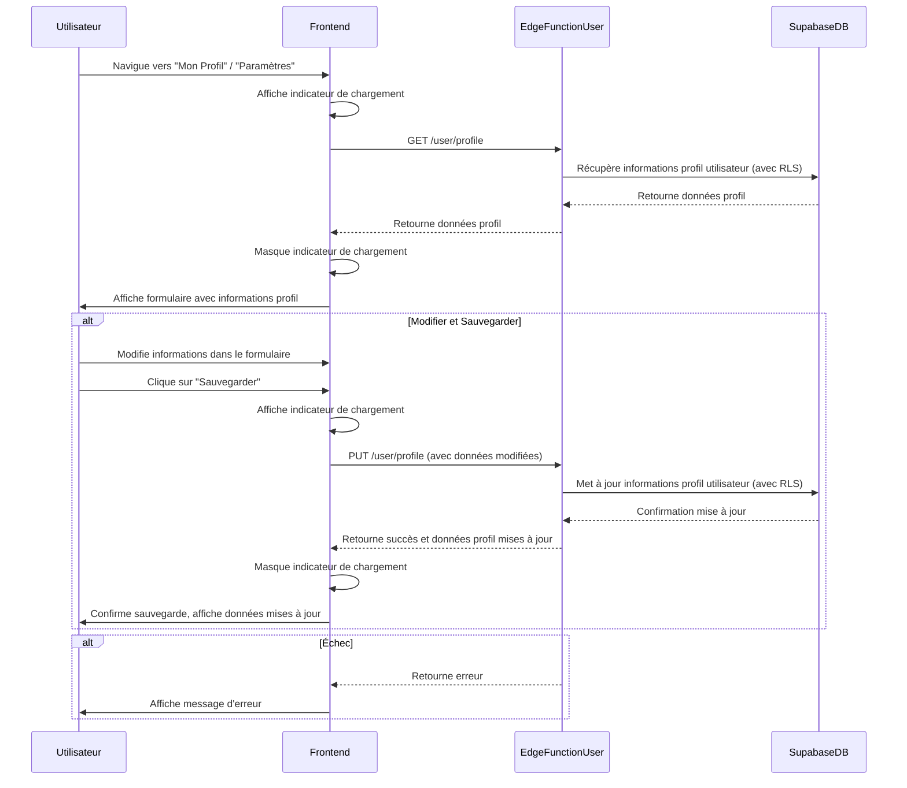

# Diagramme de Séquences : Gestion du Profil Utilisateur (FEAT-015)

Ce diagramme décrit la visualisation et la modification des informations du profil utilisateur.

```mermaid
sequenceDiagram
    participant Utilisateur
    participant Frontend
    participant EdgeFunctionUser
    participant SupabaseDB

    Utilisateur->>Frontend: Navigue vers "Mon Profil" / "Paramètres"
    Frontend->>Frontend: Affiche indicateur de chargement
    Frontend->>EdgeFunctionUser: GET /user/profile
    EdgeFunctionUser->>SupabaseDB: Récupère informations profil utilisateur (avec RLS)
    SupabaseDB-->>EdgeFunctionUser: Retourne données profil
    EdgeFunctionUser-->>Frontend: Retourne données profil
    Frontend->>Frontend: Masque indicateur de chargement
    Frontend->>Utilisateur: Affiche formulaire avec informations profil

    alt Modifier et Sauvegarder
        Utilisateur->>Frontend: Modifie informations dans le formulaire
        Utilisateur->>Frontend: Clique sur "Sauvegarder"
        Frontend->>Frontend: Affiche indicateur de chargement
        Frontend->>EdgeFunctionUser: PUT /user/profile (avec données modifiées)
        EdgeFunctionUser->>SupabaseDB: Met à jour informations profil utilisateur (avec RLS)
        SupabaseDB-->>EdgeFunctionUser: Confirmation mise à jour
        EdgeFunctionUser-->>Frontend: Retourne succès et données profil mises à jour
        Frontend->>Frontend: Masque indicateur de chargement
        Frontend->>Utilisateur: Confirme sauvegarde, affiche données mises à jour
    end

    alt Échec
        EdgeFunctionUser-->>Frontend: Retourne erreur
        Frontend->>Utilisateur: Affiche message d'erreur
    end
```
