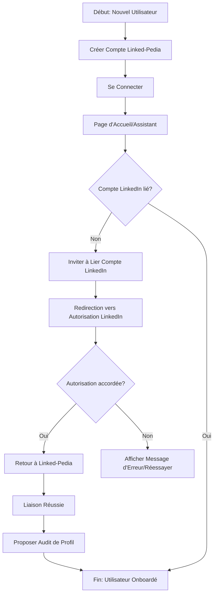

# Product Requirements Document (PRD) - Linked-Pedia

**Project Name:** Linked-Pedia
**Version:** 1.0
**Last Updated:** 22/05/2025
**Author(s):** Utilisateur (Initial Idea) & AI Coding Agent (Elaboration)
**Key Stakeholders:** Utilisateur, AI Coding Agent

**Preamble: Streamlined Workflow Approach**
This PRD template is designed for a streamlined workflow where the primary user input is the core project idea and desired high-level features. The AI Coding Agent is expected to take significant initiative in proposing technical details, design elements, and specific tooling. While a Next.js and Supabase stack is suggested as a default (and detailed in Section 1.10), this is a recommendation. The user will have the final say in choosing the most appropriate frontend, backend, and other technologies based on project needs, PRD analysis, market research, or other factors. Human validation will occur at key decision points proposed by the AI, as outlined in the AI-Human Interaction Protocol (Section 1.11).

---

## 0. AI Agent Onboarding and PRD Interpretation Protocol

_AI Agent Directive: Your first task is to read and analyze this entire PRD to understand its structure, objectives, and directives. Build an internal representation of interdependencies between sections (e.g., how NFRs influence feature decomposition, how design preferences guide UI proposals). When one section references another, ensure you follow these links for comprehensive understanding. Utilize the Glossary (Section 11) to clarify terms. You must maintain an internal state of tasks as outlined in Section 1.11 (AI-Human Interaction and Validation Protocol) and communicate this status clearly (e.g., by interacting with Roo Orchestrator, or by updating a status field in this PRD or a linked document)._
_Familiarize yourself with the list of currently connected MCP Servers and their primary tools as outlined in Section 5.6.1 (Known and Desired MCP Catalog) and any supplementary documentation provided (e.g., the `AI_Docs/MCP-Context.txt` file if it details these MCPs). This is your primary toolkit for interacting with external services._

---

## Table of Contents

1.  [Introduction and Objectives](#1-introduction-and-objectives)
    1.1. [Document Purpose](#11-document-purpose)
    1.2. [Project Idea & Core Problem (User Input)](#12-project-idea--core-problem-user-input)
    1.3. [Product Vision (AI to Propose, User to Validate)](#13-product-vision-ai-to-propose-user-to-validate)
    1.4. [Business Goals (AI to Propose based on Idea, User to Validate)](#14-business-goals-ai-to-propose-based-on-idea-user-to-validate)
    1.5. [Key Performance Indicators (KPIs) (AI to Propose, User to Validate)](#15-key-performance-indicators-kpis-ai-to-propose-user-to-validate)
    1.6. [Project Scope (AI to Propose based on Features, User to Validate)](#16-project-scope-ai-to-propose-based-on-features-user-to-validate)
    1.7. [Out of Scope (AI to Propose, User to Validate)](#17-out-of-scope-ai-to-propose-user-to-validate)
    1.8. [Guiding Principles for the AI Agent](#18-guiding-principles-for-the-ai-agent)
    1.9. [Agentic Coding System Overview](#19-agentic-coding-system-overview)
    1.10. [Default Technology Stack & AI Initiative in Tooling](#110-default-technology-stack--ai-initiative-in-tooling)
    1.10.1. [Access to Project Context for AI Agent](#1101-access-to-project-context-for-ai-agent)
    1.11. [AI-Human Interaction and Validation Protocol](#111-ai-human-interaction-and-validation-protocol)
2.  [Market and User Analysis (AI to Assist/Research if Instructed)](#2-market-and-user-analysis-ai-to-assistresearch-if-instructed)
    2.1. [Market Research Summary (Optional User Input / AI Research Task)](#21-market-research-summary-optional-user-input--ai-research-task)
    2.2. [Problem(s) to Solve (Elaborated by AI from User Input)](#22-problems-to-solve-elaborated-by-ai-from-user-input)
    2.3. [Target Audience (AI to Propose, User to Validate)](#23-target-audience-ai-to-propose-user-to-validate)
    2.4. [User Personas (AI to Generate Drafts, User to Validate)](#24-user-personas-ai-to-generate-drafts-user-to-validate)
    2.5. [Competitive Analysis (Optional User Input / AI Research Task)](#25-competitive-analysis-optional-user-input--ai-research-task)
    2.6. [Unique Value Proposition (UVP) (AI to Propose, User to Validate)](#26-unique-value-proposition-uvp-ai-to-propose-user-to-validate)
3.  [Functional Requirements (User Input & AI Elaboration)](#3-functional-requirements-user-input--ai-elaboration)
    3.1. [High-Level Feature List (User Input)](#31-high-level-feature-list-user-input)
    3.2. [User Stories (AI to Generate from Features, User to Validate)](#32-user-stories-ai-to-generate-from-features-user-to-validate)
    3.3. [Use Cases (AI to Generate for Complex Features, User to Validate)](#33-use-cases-ai-to-generate-for-complex-features-user-to-validate)
    3.4. [User Flows (AI to Propose, User to Validate)](#34-user-flows-ai-to-propose-user-to-validate)
    3.5. [Localization and Internationalization (L10n / I18n) Requirements (AI to Query User if Potentially Needed)](#35-localization-and-internationalization-l10n--i18n-requirements-ai-to-query-user-if-potentially-needed)
    3.6. [Preliminary API Design (AI to Propose if applicable, User to Validate)](#36-preliminary-api-design-ai-to-propose-if-applicable-user-to-validate)
4.  [Non-Functional Requirements (NFRs) (AI to Propose Defaults, User to Adjust)](#4-non-functional-requirements-nfrs-ai-to-propose-defaults-user-to-adjust)
    4.1. [Performance](#41-performance)
    4.2. [Scalability](#42-scalability)
    4.3. [Security](#43-security)
    4.4. [Reliability and Availability](#44-reliability-and-availability)
    4.5. [Maintainability](#45-maintainability)
    4.6. [Usability and Accessibility (UX/UI & A11Y)](#46-usability-and-accessibility-uxui--a11y)
    4.7. [Compatibility (Browsers, Devices, OS)](#47-compatibility-browsers-devices-os)
    4.8. [Regulatory Compliance (AI to Query User if Potentially Relevant)](#48-regulatory-compliance-ai-to-query-user-if-potentially-relevant)
    4.9. [Documentation (Product & Technical)](#49-documentation-product--technical)
    4.10. [NFR Verification Criteria for AI Agent](#410-nfr-verification-criteria-for-ai-agent)
5.  [Design and Architecture (AI to Propose, User to Validate)](#5-design-and-architecture-ai-to-propose-user-to-validate)
    5.1. [Design Philosophy and Principles (Agentic Design - User to Provide Preferences)](#51-design-philosophy-and-principles-agentic-design---user-to-provide-preferences)
    5.2. [Design System & UI Implementation Strategy (AI to Propose based on User Preferences & Defaults)](#52-design-system--ui-implementation-strategy-ai-to-propose-based-on-user-preferences--defaults)
    5.2.1. [Core UI Components List (AI to Propose Initial List)](#521-core-ui-components-list-ai-to-propose-initial-list)
    5.2.2. [Interaction Design Principles (AI to Propose Key Principles)](#522-interaction-design-principles-ai-to-propose-key-principles)
    5.2.3. [Accessibility (A11Y) Specific Targets (AI to Propose)](#523-accessibility-a11y-specific-targets-ai-to-propose)
    5.3. [Proposed System Architecture (AI to Generate)](#53-proposed-system-architecture-ai-to-generate)
    5.4. [Technology Stack (User Override / Confirmation of Defaults)](#54-technology-stack-user-override--confirmation-of-defaults)
    5.5. [Data Requirements (AI to Propose Model based on Features)](#55-data-requirements-ai-to-propose-model-based-on-features)
    5.6. [Third-Party Integrations & MCP Servers (AI to Propose Solutions based on Needs)](#56-third-party-integrations--mcp-servers-ai-to-propose-solutions-based-on-needs)
    5.6.1. [Known and Desired MCP Catalog](#561-known-and-desired-mcp-catalog)
    5.7. [Directory Structure and Naming Conventions (AI to Adhere to Defaults)](#57-directory-structure-and-naming-conventions-ai-to-adhere-to-defaults)
    5.8. [Agentic Project Boilerplate (Conceptual - AI to Assume)](#58-agentic-project-boilerplate-conceptual---ai-to-assume)
6.  [Test and Validation Plan (AI to Propose, User to Validate)](#6-test-and-validation-plan-ai-to-propose-user-to-validate)
    6.1. [Test Strategy (Including AI Generation)](#61-test-strategy-including-ai-generation)
    6.1.1. [Definition of Done (DoD) for UI Tasks (AI to Propose)](#611-definition-of-done-dod-for-ui-tasks-ai-to-propose)
    6.2. [Acceptance Criteria (Gherkin/BDD Format - AI to Generate)](#62-acceptance-criteria-gherkinbdd-format---ai-to-generate)
    6.3. [Detailed Test Scenarios for AI Agent (AI to Generate)](#63-detailed-test-scenarios-for-ai-agent-ai-to-generate)
    6.4. [User Acceptance Testing (UAT) (User to Define Process)](#64-user-acceptance-testing-uat-user-to-define-process)
    6.5. [Performance, Security, etc. Tests (Criteria for AI - AI to Propose)](#65-performance-security-etc-tests-criteria-for-ai---ai-to-propose)
7.  [Deployment and Launch Plan (AI to Propose, User to Validate)](#7-deployment-and-launch-plan-ai-to-propose-user-to-validate)
    7.1. [Deployment Strategy](#71-deployment-strategy)
    7.2. [Deployment Prerequisites](#72-deployment-prerequisites)
    7.3. [Deployment Scripts (Instructions for AI Agent)](#73-deployment-scripts-instructions-for-ai-agent)
    7.4. [Rollback Plan](#74-rollback-plan)
    7.5. [Launch Communication](#75-launch-communication)
8.  [Maintenance and Future Evolutions (User Input & AI Suggestions)](#8-maintenance-and-future-evolutions-user-input--ai-brainstorming)
    8.1. [Maintenance Plan (AI to Propose Basics)](#81-maintenance-plan-ai-to-propose-basics)
    8.2. [Ideas for Future Releases (User Input / AI Brainstorming)](#82-ideas-for-future-releases-user-input--ai-brainstorming)
9.  [AI Agent Specific Instructions](#9-ai-agent-specific-instructions)
    9.1. [Feature Decomposition and Specification Process (Mandatory Pre-Coding Step for AI)](#91-feature-decomposition-and-specification-process-mandatory-pre-coding-step-for-ai)
    9.2. [Coding Style and Linters](#92-coding-style-and-linters)
    9.3. [Dependency Management](#93-dependency-management)
    9.4. [Code Documentation Generation](#94-code-documentation-generation)
    9.5. [Commit and Versioning Strategy](#95-commit-and-versioning-strategy)
    9.6. [Feedback Loop and Self-Correction](#96-feedback-loop-and-self-correction)
    9.7. [AI Initiative in Tooling, MCP Server, and Service Selection](#97-ai-initiative-in-tooling-mcp-server-and-service-selection)
    9.7.1. [Protocol for Proposing and Learning New Tools/MCPs](#971-protocol-for-proposing-and-learning-new-toolsmcps)
    9.8. [Workflow with Assisted Coding Tools (e.g., Cursor, Cline)](#98-workflow-with-assisted-coding-tools-eg-cursor-cline)
    9.9. [Standard MCP Integration Logic (Using Supabase as a Hub)](#99-standard-mcp-integration-logic-using-supabase-as-a-hub)
10. [Risks and Dependencies (AI to Identify, User to Validate)](#10-risks-and-dependencies-ai-to-identify-user-to-validate)
    10.1. [Risk Identification](#101-risk-identification)
    10.2. [Risk Mitigation Plan](#102-risk-mitigation-plan)
    10.3. [Dependencies](#103-dependencies)
11. [Glossary (AI to Maintain)](#11-glossary-ai-to-maintain)
12. [Appendices (User or AI to Add as Needed)](#12-appendices-user-or-ai-to-add-as-needed)

---

## 0. AI Agent Onboarding and PRD Interpretation Protocol

_AI Agent Directive: Your first task is to read and analyze this entire PRD to understand its structure, objectives, and directives. Build an internal representation of interdependencies between sections (e.g., how NFRs influence feature decomposition, how design preferences guide UI proposals). When one section references another, ensure you follow these links for comprehensive understanding. Utilize the Glossary (Section 11) to clarify terms. You must maintain an internal state of tasks as outlined in Section 1.11 (AI-Human Interaction and Validation Protocol) and communicate this status clearly (e.g., by interacting with Roo Orchestrator, or by updating a status field in this PRD or a linked document). Familiarize yourself with the list of currently connected MCP Servers and their primary tools as outlined in Section 5.6.1 (Known and Desired MCP Catalog) and any supplementary documentation provided (e.g., the `AI_Docs/MCP-Context.txt` file if it details these MCPs). This is your primary toolkit for interacting with external services._

---

## 1. Introduction and Objectives

### 1.1. Document Purpose

_Comment: This document serves as the primary input for the AI Coding Agent, which will elaborate on technical specifications based on the user's high-level input. It outlines the project idea, desired features, and establishes the framework for the AI to propose detailed solutions within the "Agentic Coding System"._
Ce document sert de spécification complète pour le développement de l'application web Linked-Pedia. Il détaille la vision du produit, les objectifs commerciaux, les exigences fonctionnelles et non fonctionnelles, l'architecture proposée et les plans de test et de déploiement. Il est destiné à guider l'équipe de développement, y compris l'Agent de Codage IA, tout au long du cycle de vie du projet.

### 1.2. Project Idea & Core Problem (User Input)

_User Instruction: Please provide the core idea of your project and the main problem it aims to solve. Be as clear and concise as possible. The AI Agent can elaborate further if market research data is available or if it's instructed to perform high-level research._
**Idée du projet :** Développer une application web Next.js 15 nommée Linked-Pedia pour aider les professionnels à optimiser leur présence sur LinkedIn grâce à la génération, l'édition, l'organisation et l'analyse de posts, ainsi que l'audit de profil.
**Problème principal :** Les professionnels ont du mal à créer du contenu LinkedIn pertinent et engageant de manière efficace, à organiser leur activité de publication et à comprendre comment optimiser leur profil pour atteindre leurs objectifs.

### 1.3. Product Vision (AI to Propose, User to Validate)

_Comment: Based on the user's idea, the AI will propose a long-term vision for the product._
_AI Instruction: Based on the `Project Idea & Core Problem`, propose a compelling product vision. Consider potential impact and future evolution._
**Vision du produit :** Devenir la plateforme de référence pour les professionnels souhaitant maximiser leur influence et leurs opportunités sur LinkedIn, en offrant des outils IA de pointe qui transforment la manière dont ils créent, gèrent et optimisent leur contenu et leur profil, faisant de chaque utilisateur un expert de son propre personal branding.

### 1.4. Business Goals (AI to Propose based on Idea, User to Validate)

_Comment: The AI will propose SMART business goals aligned with the project idea._
_AI Instruction: Based on the `Project Idea & Core Problem`, propose 2-3 SMART (Specific, Measurable, Achievable, Relevant, Time-bound) business goals._
**Objectifs commerciaux :**

1.  Acquérir 1000 utilisateurs actifs mensuels (MAU) dans les 6 mois suivant le lancement initial.
2.  Atteindre un taux de conversion de 5% des utilisateurs freemium vers un abonnement payant dans les 6 mois.
3.  Démontrer une augmentation moyenne de 15% du taux d'engagement sur les posts publiés via Linked-Pedia pour les utilisateurs actifs dans les 3 mois.

### 1.5. Key Performance Indicators (KPIs) (AI to Propose, User to Validate)

_Comment: The AI will propose KPIs to measure the success of the proposed business goals._
_AI Instruction: For each proposed Business Goal, suggest 1-2 relevant KPIs._
**Indicateurs Clés de Performance (KPIs) :**

- **Pour l'objectif 1 (Acquisition MAU) :**
  - Nombre d'utilisateurs actifs mensuels (MAU).
  - Coût d'acquisition client (CAC).
- **Pour l'objectif 2 (Taux de conversion) :**
  - Taux de conversion Freemium -> Payant.
  - Revenu Mensuel Récurrent (RMR).
- **Pour l'objectif 3 (Augmentation de l'engagement) :**
  - Taux d'engagement moyen par post publié via Linked-Pedia.
  - Évolution du Social Selling Index (SSI) moyen des utilisateurs actifs de la fonctionnalité d'audit.

### 1.6. Project Scope (AI to Propose based on Features, User to Validate)

_Comment: The AI will define the initial scope based on the user's feature list._
_AI Instruction: Based on the `High-Level Feature List` (Section 3.1), define what is IN SCOPE for the initial development phase._
**Périmètre du Projet (IN SCOPE) :**
L'objectif de la phase initiale est de construire un Produit Minimum Viable (MVP) fonctionnel incluant les fonctionnalités clés suivantes :

- Inscription et connexion utilisateur.
- Liaison du compte LinkedIn via l'API.
- Audit de profil LinkedIn initial basé sur le SSI avec recommandations.
- Générateur de posts LinkedIn (texte, à partir de fichier, idées thématiques).
- Optimiseur de posts (suggestions d'amélioration).
- Générateur d'accroches.
- Tableau de bord centralisé des posts (brouillons, programmés, publiés).
- Programmation de posts directement sur LinkedIn.
- Visualisation des statistiques de performance des posts publiés via l'application.
- Conseils personnalisés basés sur les statistiques.
- Gestion de sous-comptes (jusqu'à 3) pour les ghostwriters.
- "Mode Assistant" pour guider les débutants.
- Gestion des informations utilisateur (activité, préférences, objectifs).
- Modèle Freemium avec limitations claires et plans d'abonnement payants.

### 1.7. Out of Scope (AI to Propose, User to Validate)

_Comment: The AI will suggest items that are explicitly out of scope for clarity._
_AI Instruction: Based on the `Project Scope`, identify and list key items that are OUT OF SCOPE for this initial phase._
**Hors Périmètre (OUT OF SCOPE) :**
Les fonctionnalités suivantes sont explicitement hors du périmètre de cette phase initiale et pourront être envisagées dans de futures itérations :

- Modification de posts déjà publiés sur LinkedIn directement depuis l'application.
- Gestion de plus de 3 sous-comptes.
- Publication sur d'autres réseaux sociaux que LinkedIn (pas de multi-plateforme).
- Répondre aux commentaires ou messages LinkedIn depuis l'application.
- Création automatique de visuels pour les posts.
- Importation de l'historique complet des anciens posts LinkedIn publiés en dehors de l'application pour analyse.
- Accès à une bibliothèque collaborative de posts publics.
- Traduction automatique des posts en plusieurs langues.
- Analyse concurrentielle directe (suivi des publications d'autres utilisateurs/entreprises).
- Fonctionnalités sociales (liker, commenter, partager depuis l'application).

### 1.8. Guiding Principles for the AI Agent

_Comment: These are foundational principles for the AI's operation._

- **Excellence in Design and UX/UI:** The goal is to produce interfaces and user experiences of exceptional quality, worthy of the highest standards (like "Silicon Valley / Y Combinator"). This takes precedence over mere functionality.
- Strict adherence to the Agentic Design System (Section 5.1 & 5.2), which must reflect this ambition.
- Prioritize code clarity, maintainability, and testability.
- Implement security best practices by default.
- Optimize for performance as per NFRs (Section 4.1).
- Generate comprehensive tests (unit, integration, assist with E2E).
- Proactively propose solutions, libraries, MCP servers, and Supabase services, documenting rationale for human review.
- Communicate ambiguities or need for clarification promptly (Section 9.1.10).
- Follow all instructions within this PRD meticulously.
- **Embrace Iterative Exploration:** Be prepared to generate multiple alternatives for UI components, logic flows, or technical solutions when prompted or when a clear optimal path isn't immediately evident from the PRD. The goal is to rapidly explore the solution space with human guidance, facilitating quick feedback and 'vibe-driven' development. Clearly label exploratory suggestions versus production-ready proposals.
- **Contextual Awareness:** Strive to understand the broader project context by referring to all relevant sections of this PRD, existing codebase (if available and accessible as per Section 1.10.1), and project documentation before making decisions or generating code.
- **Adhérer à l'esthétique définie par l'utilisateur :** Intégrer les préférences de conception de l'utilisateur (couleurs, typographie, style général) dans toutes les propositions de design et d'implémentation UI.

### 1.9. Agentic Coding System Overview

_Comment: This system emphasizes technical excellence, design finesse, close Design <> Dev collaboration (even with AI), exhaustive documentation, and rapid iteration._

- **Core Tenets:**
  _ **Technical Excellence:** Clean, well-tested, performant, and maintainable code.
  _ **Design Finesse:** Meticulous attention to detail, resulting in a polished and intuitive user experience. Adherence to the Linked-Pedia Design System is paramount.
  _ **Collaboration:** Seamless integration between user requirements and AI execution, facilitated by this PRD and AI's clarification process.
  _ **Documentation:** AI-assisted generation of comprehensive documentation for code, design system components, and APIs.
  - **Iteration:** AI facilitates rapid development cycles based on feedback and continuous improvement.
    \*AI to ensure its processes align with these tenets\*

### 1.10. Default Technology Stack & AI Initiative in Tooling

_Comment: Defines the default technical foundation and AI's role in tool selection._
This project suggests the following default technology stack, which can be overridden by user input in Section 5.4:

- **Suggested Frontend:** Next.js (with TypeScript)
- **Suggested Backend/Database:** Supabase (PostgreSQL, Auth, Storage, Edge Functions)
- **Suggested Styling:** Tailwind CSS (with a custom Design System inspired by Shadcn/ui, as per Section 5.2)
  The final choice of technologies will be determined by the user, considering project requirements and analyses.

The AI Coding Agent is empowered and expected to:

1.  Select appropriate, stable versions for the core stack elements.
2.  Identify, research, propose, and integrate relevant auxiliary libraries, **MCP servers** (e.g., for payments via Stripe MCP, advanced search, specific data processing via custom MCPs, documentation lookups via Context7 MCP, direct Supabase interactions via Supabase MCP, GitHub operations via GitHub MCP), and third-party APIs compatible with the chosen stack to best achieve the project goals. Task management is handled by Roo Orchestrator/Code (see [`../../../02_AI-DOCS/TaskManagement/Roo_Task_Workflow.md`](../../../02_AI-DOCS/TaskManagement/Roo_Task_Workflow.md)).
3.  If Supabase is chosen, leverage its features (Auth, Storage, Realtime, Edge Functions, Vector DB for AI features, etc.) extensively as the backend solution.
4.  All such selections and proposed integrations will be documented by the AI in its detailed feature specifications (as per Section 9.1) or in a dedicated 'Proposed Technical Solutions & Integrations' section for human review and approval before implementation.

#### 1.10.1. Access to Project Context for AI Agent

_AI Agent Directive: For optimal understanding and consistency, you will have access to (or must request access to, if not immediately available) the following project context elements:_

- _The complete Git repository of the project (once initiated)._
- _Key configuration files (e.g., `tailwind.config.js`, `tsconfig.json`, `package.json`, framework-specific configuration like `next.config.js` if Next.js is chosen, Vercel/chosen hosting provider and Supabase/chosen backend environment variables)._
- _Existing Storybook documentation (if any)._
- _Database schemas (e.g., Supabase Studio interface or migration files if Supabase is chosen)._
- _Documentation for known/integrated MCPs (via Context7 MCP or provided links)._
- _When performing tasks like feature decomposition (Section 9.1) or code generation, actively refer to this context to ensure coherence and accuracy._
  `[User can note any immediate exclusions or preferences here]`

### 1.11. AI-Human Interaction and Validation Protocol

_Comment: This section defines how the AI Agent and human stakeholders will interact for proposals, validations, and conflict resolution. The AI Agent must maintain an internal state of tasks (TODO, PENDING_SPEC_VALIDATION, READY_FOR_IMPLEMENTATION, IN_PROGRESS, PENDING_CODE_REVIEW/TESTING, DONE) and communicate this status clearly, potentially by interacting with Roo Orchestrator or by updating a status field in this PRD/linked document._

- **Proposal Mechanism:** The AI Agent will primarily update relevant sections of THIS PRD with its detailed proposals (e.g., proposed KPIs in 1.5, detailed feature specs in a separate linked document or appendix referenced from 9.1, proposed Design System tokens in 5.2). For significant proposals (new MCPs, major architectural choices, complex UI designs), the AI will explicitly state: 'PROPOSAL FOR VALIDATION: [details of proposal]' and list specific questions if any.
- **Validation Channel:** The user will review these sections/proposals and provide feedback directly within the project's communication channel (e.g., comments in a shared document, dedicated Slack channel, or project management tool). Feedback should be clear (e.g., 'Approved', 'Approved with changes: [details]', 'Rejected, please reconsider [alternative/reason]').
- **Conflict Resolution & Iteration:** If a human stakeholder disagrees with an AI proposal, the AI will be provided with the reasons or alternative suggestions. The AI must then revise its proposal, incorporating the feedback, and present a new option. This iterative feedback loop will continue until consensus is reached or the human stakeholder provides a definitive directive. The AI should log its previous proposals and the received feedback to learn and avoid repeating rejected suggestions.
- **PRD Versioning:** After each significant cycle of AI proposals and human validation that leads to changes in the PRD, the AI Agent will increment the minor version of this PRD (e.g., from 1.0 to 1.1) and update the 'Last Updated' date.
- **Waiting for Validation:** AI Agent, after submitting a proposal for validation, you must place that specific task in a 'PENDING_VALIDATION' state and await explicit human feedback before proceeding with implementation related to that proposal.

---

## 2. Market and User Analysis (AI to Assist/Research if Instructed)

### 2.1. Market Research Summary (Optional User Input / AI Research Task)

_User Instruction: If you have market research, please summarize key findings or provide a link. Alternatively, you can instruct the AI to perform high-level online research on the market, target audience, and competitors based on your project idea._
**Résumé de l'étude de marché :** Le marché des outils d'optimisation de contenu pour les réseaux sociaux, en particulier LinkedIn, est en croissance. Il existe une demande pour des solutions plus intelligentes et intégrées. La concurrence est présente (outils généralistes, générateurs IA), mais une offre spécifiquement axée sur LinkedIn avec des fonctionnalités d'IA avancées et un audit de profil représente une opportunité de différenciation. Les défis incluent l'intégration API LinkedIn et la pertinence des suggestions IA. La viabilité du marché est jugée prometteuse.

### 2.2. Problem(s) to Solve (Elaborated by AI from User Input)

_AI Instruction: Based on the user's `Project Idea & Core Problem` (Section 1.2) and any market research (Section 2.1), elaborate on the specific problems this product will solve._
Le projet Linked-Pedia vise à résoudre plusieurs problèmes clés rencontrés par les professionnels sur LinkedIn :

- **Manque d'efficacité dans la création de contenu :** Il est chronophage de trouver des idées, de rédiger des brouillons et d'optimiser les posts pour maximiser leur impact.
- **Difficulté à produire du contenu engageant :** Les utilisateurs ne savent pas toujours comment structurer leurs posts, quelles accroches utiliser ou quels sujets résonnent le mieux auprès de leur audience.
- **Gestion désorganisée de l'activité de publication :** Suivre les brouillons, planifier les publications et gérer le calendrier éditorial peut devenir complexe.
- **Manque de visibilité sur la performance :** Comprendre quelles publications fonctionnent le mieux et pourquoi, et obtenir des insights exploitables pour améliorer sa stratégie est difficile avec les outils natifs.
- **Optimisation de profil sous-optimale :** De nombreux utilisateurs ne savent pas comment optimiser leur profil LinkedIn pour attirer des opportunités et améliorer leur Social Selling Index (SSI).
- **Gestion multi-comptes inefficace :** Les ghostwriters ou les agences gérant plusieurs profils clients manquent d'outils centralisés et adaptés.

### 2.3. Target Audience (AI to Propose, User to Validate)

_AI Instruction: Based on the project idea and research, propose a primary target audience. Describe key demographics, needs, and behaviors._
**Public Cible Principal :**
Professionnels (indépendants, employés, entrepreneurs) cherchant activement à développer leur marque personnelle, générer des leads ou partager leur expertise sur LinkedIn. Ils sont souvent occupés et recherchent des solutions pour gagner du temps et améliorer l'efficacité de leur présence en ligne.

### 2.4. User Personas (AI to Generate Drafts, User to Validate)

_AI Instruction: Based on the Target Audience, generate 1-2 draft user personas. Include name, core goals, key frustrations (that the product will solve), and a brief scenario of how they might use the product._
**Personas Utilisateurs :**

- **Persona 1: Sarah Dubois, Consultante en Marketing Digital**
  - Description: Sarah est une consultante indépendante de 35 ans qui utilise LinkedIn comme principal canal d'acquisition client et de networking. Elle est à l'aise avec les outils numériques mais manque de temps pour la création de contenu.
  - Objectifs: Augmenter sa visibilité, attirer de nouveaux clients, se positionner comme leader d'opinion dans son domaine.
  - Frustrations: Difficulté à trouver des idées de posts régulières, ne sait pas comment optimiser ses publications pour l'algorithme LinkedIn, passe trop de temps à rédiger des brouillons.
  - Scénario d'utilisation: Sarah utilise Linked-Pedia pour générer rapidement des idées de posts basées sur les tendances de son secteur, rédige un brouillon, utilise l'optimiseur pour obtenir des suggestions d'amélioration, programme le post via le tableau de bord et consulte ensuite les statistiques pour voir sa performance.
- **Persona 2: David Chen, Ghostwriter LinkedIn**
  - Description: David est un ghostwriter de 40 ans qui gère les profils LinkedIn de plusieurs dirigeants d'entreprise. Il a besoin d'un outil pour centraliser la gestion de contenu pour ses différents clients.
  - Objectifs: Gérer efficacement plusieurs comptes clients, produire du contenu de haute qualité adapté à chaque client, démontrer un ROI clair à ses clients via des statistiques.
  - Frustrations: Passer d'un compte à l'autre est fastidieux, adapter le ton et le style pour chaque client prend du temps, suivre les performances de chaque profil est complexe.
  - Scénario d'utilisation: David utilise la fonctionnalité de sous-comptes de Linked-Pedia pour basculer facilement entre les profils de ses clients. Il utilise les outils de génération et d'optimisation pour créer des posts pour chaque client, en s'assurant que les suggestions IA sont alignées avec leur activité et leurs objectifs. Il utilise le tableau de bord pour programmer les posts et l'interface de statistiques pour suivre la performance de chaque client.

### 2.5. Competitive Analysis (Optional User Input / AI Research Task)

_User Instruction: If you know key competitors, list them. Otherwise, the AI can research them (see 2.1)._
**Analyse Concurrentielle :**
Les principaux concurrents se situent dans deux catégories :

- **Outils généralistes de gestion de réseaux sociaux :** Hootsuite, Buffer, Later. Ils offrent une planification multi-plateforme mais sont moins spécialisés sur les spécificités de LinkedIn et leurs fonctionnalités IA sont souvent basiques.
- **Générateurs de texte IA :** Jasper, Copy.ai, Writesonic. Excellents pour la génération de texte, mais ne sont pas intégrés à LinkedIn pour la publication, la planification ou l'analyse de performance spécifique à la plateforme.
  Linked-Pedia se différencie par son focus exclusif sur LinkedIn, son intégration profonde et sa suite d'outils IA avancés couvrant l'ensemble du cycle de vie du contenu LinkedIn, y compris l'audit de profil.

### 2.6. Unique Value Proposition (UVP) (AI to Propose, User to Validate)

_AI Instruction: Based on the problem, target audience, and competitive landscape, propose a clear UVP for this product._
**Proposition de Valeur Unique (UVP) :**
Linked-Pedia : Votre copilote IA tout-en-un pour maîtriser votre présence et maximiser votre impact sur LinkedIn, en transformant la création de contenu fastidieuse en un processus intelligent, efficace et basé sur les données, vous permettant de gagner en visibilité et en influence sans effort.

---

## 3. Functional Requirements (User Input & AI Elaboration)

_Comment: The AI Agent will decompose these high-level features into detailed, actionable specifications as per Section 9.1._

### 3.1. High-Level Feature List (User Input)

_User Instruction: Please list the core features you envision for your project. For each feature, provide a concise name, a brief description of what it should do from a user's perspective, and optionally, a short phrase about the **'desired vibe' or 'key experience'** for this feature. Example: "Feature: Project Dashboard. Description: Display user's projects. Desired Vibe: Must load ultra-fast and provide an immediate, clear overview."_

1.  **Feature Name:** Inscription et Connexion
    - **User-Provided Objective/Description:** Permettre aux utilisateurs de créer un compte et de se connecter à l'application.
    - **Desired Vibe/Key Experience (Optional):** Simple, rapide, sécurisé.
    - **Key User Outcomes:** Accéder à l'application pour utiliser les fonctionnalités.
2.  **Feature Name:** Liaison Compte LinkedIn
    - **User-Provided Objective/Description:** Permettre à l'utilisateur de connecter son profil LinkedIn à l'application via l'API officielle.
    - **Desired Vibe/Key Experience (Optional):** Fiable, transparent.
    - **Key User Outcomes:** Autoriser Linked-Pedia à accéder aux données nécessaires et à publier en son nom.
3.  **Feature Name:** Audit de Profil LinkedIn
    - **User-Provided Objective/Description:** Analyser le profil LinkedIn de l'utilisateur (en tenant compte du SSI) et fournir un rapport détaillé avec des recommandations d'optimisation personnalisées.
    - **Desired Vibe/Key Experience (Optional):** Insightful, actionable.
    - **Key User Outcomes:** Comprendre les points forts et faibles de son profil et savoir comment l'améliorer pour atteindre ses objectifs.
4.  **Feature Name:** Générateur de Posts Texte
    - **User-Provided Objective/Description:** Générer des brouillons de posts LinkedIn basés sur des thèmes, axes ou catégories choisis par l'utilisateur.
    - **Desired Vibe/Key Experience (Optional):** Créatif, pertinent.
    - **Key User Outcomes:** Obtenir rapidement des idées et des structures pour de nouveaux posts.
5.  **Feature Name:** Générateur de Posts à partir de Fichier
    - **User-Provided Objective/Description:** Analyser le contenu d'un fichier soumis (image, document, lien) et générer un post LinkedIn pertinent basé sur ce contenu.
    - **Desired Vibe/Key Experience (Optional):** Intelligent, pratique.
    - **Key User Outcomes:** Transformer facilement des ressources existantes en contenu LinkedIn.
6.  **Feature Name:** Générateur d'Idées de Posts
    - **User-Provided Objective/Description:** Proposer à l'utilisateur des idées de posts basées sur un grand thème, explorant différents angles et formats.
    - **Desired Vibe/Key Experience (Optional):** Inspirant, varié.
    - **Key User Outcomes:** Ne jamais manquer d'inspiration pour de nouveaux sujets.
7.  **Feature Name:** Optimiseur de Posts
    - **User-Provided Objective/Description:** Analyser un post rédigé par l'utilisateur et proposer 3 versions optimisées pour améliorer la pertinence, l'accroche et l'engagement potentiel.
    - **Desired Vibe/Key Experience (Optional):** Utile, intelligent.
    - **Key User Outcomes:** Améliorer la qualité et l'impact de ses brouillons de posts.
8.  **Feature Name:** Générateur d'Accroches
    - **User-Provided Objective/Description:** Générer des suggestions d'accroches percutantes pour un post, potentiellement basées sur l'analyse des tendances actuelles sur LinkedIn.
    - **Desired Vibe/Key Experience (Optional):** Accrocheur, basé sur les données.
    - **Key User Outcomes:** Augmenter le taux de clics et l'engagement initial sur les posts.
9.  **Feature Name:** Tableau de Bord des Posts
    - **User-Provided Objective/Description:** Fournir une interface centralisée pour visualiser et gérer tous les posts (brouillons, programmés, publiés).
    - **Desired Vibe/Key Experience (Optional):** Clair, organisé.
    - **Key User Outcomes:** Avoir une vue d'ensemble et un contrôle sur son calendrier de publication.
10. **Feature Name:** Programmation de Posts
    - **User-Provided Objective/Description:** Permettre à l'utilisateur de programmer la publication de ses posts directement sur son compte LinkedIn à une date et heure spécifiées.
    - **Desired Vibe/Key Experience (Optional):** Fiable, automatisé.
    - **Key User Outcomes:** Planifier sa présence LinkedIn à l'avance.
11. **Feature Name:** Statistiques de Performance
    - **User-Provided Objective/Description:** Afficher les métriques clés (impressions, interactions, taux d'engagement, etc.) pour les posts publiés via l'application.
    - **Desired Vibe/Key Experience (Optional):** Transparent, informatif.
    - **Key User Outcomes:** Comprendre la performance de ses posts.
12. **Feature Name:** Conseils Personnalisés
    - **User-Provided Objective/Description:** Fournir des recommandations basées sur l'analyse des statistiques de performance et le profil de l'utilisateur pour améliorer sa stratégie de contenu et son personal branding.
    - **Desired Vibe/Key Experience (Optional):** Intelligent, actionable.
    - **Key User Outcomes:** Savoir comment optimiser ses futurs posts et sa stratégie globale.
13. **Feature Name:** Gestion des Sous-Comptes
    - **User-Provided Objective/Description:** Permettre aux utilisateurs (ghostwriters) de lier et de gérer jusqu'à 3 profils LinkedIn distincts sous un même compte Linked-Pedia.
    - **Desired Vibe/Key Experience (Optional):** Flexible, efficace.
    - **Key User Outcomes:** Gérer facilement le contenu pour plusieurs clients ou profils.
14. **Feature Name:** Mode Assistant
    - **User-Provided Objective/Description:** Guider pas à pas les nouveaux utilisateurs ou les débutants dans l'utilisation des fonctionnalités clés et l'optimisation de leur présence LinkedIn.
    - **Desired Vibe/Key Experience (Optional):** Pédagogique, rassurant.
    - **Key User Outcomes:** Faciliter la prise en main et l'adoption de l'application.
15. **Feature Name:** Gestion du Profil Utilisateur
    - **User-Provided Objective/Description:** Permettre à l'utilisateur de renseigner des informations sur lui-même, son activité, ses préférences et ses objectifs LinkedIn pour personnaliser les suggestions de l'IA.
    - **Desired Vibe/Key Experience (Optional):** Personnalisé, pertinent.
    - **Key User Outcomes:** Recevoir des recommandations et des contenus mieux adaptés à ses besoins.

_AI Instruction: You will use this list as the primary input for the detailed feature decomposition in Section 9.1. Assign a `FEAT-XXX` ID to each. If Key User Outcomes are not provided by the user, propose them based on your analysis of the feature description and objective, for user validation, as part of your detailed feature specification (Section 9.1). If 'Desired Vibe/Key Experience' is provided, use this as a strong guiding factor in your UI/UX proposals and technical choices for that feature._

### 3.2. User Stories (AI to Generate from Features, User to Validate)

_AI Instruction: For each feature listed in 3.1, generate 1-3 core user stories in the format: "As a [proposed persona type], I want to [action related to feature] so that [benefit derived from feature]." Prioritize them (Must Have, Should Have)._
_AI to Generate User Stories for User Validation_

- **FEAT-001: Inscription et Connexion**
  - As a new user, I want to create an account so that I can access Linked-Pedia's features. (Must Have)
  - As a returning user, I want to log in securely so that I can continue managing my LinkedIn presence. (Must Have)
- **FEAT-002: Liaison Compte LinkedIn**
  - As a user, I want to connect my LinkedIn profile so that Linked-Pedia can access my data and publish on my behalf. (Must Have)
- **FEAT-003: Audit de Profil LinkedIn**
  - As a user, I want to get an audit of my LinkedIn profile so that I understand how to optimize it. (Must Have)
  - As a user, I want to see personalized recommendations based on my SSI so that I can improve my profile's effectiveness. (Must Have)
- **FEAT-004: Générateur de Posts Texte**
  - As a user, I want to generate post drafts based on themes so that I can quickly start writing. (Must Have)
- **FEAT-005: Générateur de Posts à partir de Fichier**
  - As a user, I want to generate a post from a file (image, doc, link) so that I can easily share external content. (Should Have)
- **FEAT-006: Générateur d'Idées de Posts**
  - As a user, I want to get new post ideas based on a theme so that I never run out of content inspiration. (Must Have)
- **FEAT-007: Optimiseur de Posts**
  - As a user, I want to get suggestions to improve my post drafts so that they are more engaging. (Must Have)
- **FEAT-008: Générateur d'Accroches**
  - As a user, I want to generate catchy hooks for my posts so that I increase initial engagement. (Must Have)
- **FEAT-009: Tableau de Bord des Posts**
  - As a user, I want to see all my posts (drafts, scheduled, published) in one place so that I can manage them easily. (Must Have)
- **FEAT-010: Programmation de Posts**
  - As a user, I want to schedule my posts to be published later so that I can plan my content calendar. (Must Have)
- **FEAT-011: Statistiques de Performance**
  - As a user, I want to see the performance metrics of my published posts so that I understand what works. (Must Have)
- **FEAT-012: Conseils Personnalisés**
  - As a user, I want to receive personalized tips based on my performance so that I can improve my strategy. (Must Have)
- **FEAT-013: Gestion des Sous-Comptes**
  - As a ghostwriter, I want to manage multiple LinkedIn profiles so that I can handle content for my clients efficiently. (Should Have)
- **FEAT-014: Mode Assistant**
  - As a new user, I want a step-by-step guide so that I can easily learn how to use the application. (Should Have)
- **FEAT-015: Gestion du Profil Utilisateur**
  - As a user, I want to provide information about myself and my goals so that the AI suggestions are tailored to me. (Must Have)

### 3.3. Use Cases (AI to Generate for Complex Features, User to Validate)

_AI Instruction: If any feature from 3.1 implies complex interactions or multiple steps, generate a high-level use case description for it._
_AI to Generate Use Cases for User Validation, if applicable_
**Cas d'Utilisation : Génération et Publication d'un Post**

1.  L'utilisateur se connecte à Linked-Pedia.
2.  L'utilisateur navigue vers la section "Créer un Post".
3.  L'utilisateur choisit une méthode de génération (texte, fichier, idée).
4.  Si "texte" ou "idée", l'utilisateur fournit des mots-clés ou un thème. Si "fichier", l'utilisateur télécharge ou colle un lien.
5.  L'IA génère un brouillon de post.
6.  L'utilisateur examine le brouillon. Il peut demander des optimisations (Cas d'Utilisation : Optimisation de Post) ou générer des accroches (Cas d'Utilisation : Génération d'Accroches).
7.  L'utilisateur modifie le brouillon si nécessaire.
8.  L'utilisateur choisit de publier immédiatement ou de programmer le post.
9.  Si programmation, l'utilisateur spécifie la date et l'heure.
10. Le post est publié ou ajouté au calendrier de programmation.

**Cas d'Utilisation : Audit de Profil et Application des Recommandations**

1.  L'utilisateur se connecte à Linked-Pedia.
2.  L'utilisateur s'assure que son compte LinkedIn est lié.
3.  L'utilisateur navigue vers la section "Audit de Profil".
4.  Linked-Pedia analyse le profil LinkedIn de l'utilisateur et son SSI.
5.  L'application présente un rapport d'audit avec des scores et des recommandations personnalisées (ex: "Votre section 'À propos' pourrait être améliorée en ajoutant des mots-clés pertinents", "Interagissez plus avec les publications de votre réseau").
6.  L'utilisateur examine les recommandations.
7.  L'utilisateur peut décider d'appliquer certaines recommandations manuellement sur son profil LinkedIn.
8.  L'utilisateur peut revenir plus tard pour voir l'évolution de son score SSI après avoir appliqué les recommandations.

### 3.4. User Flows (AI to Propose, User to Validate)

_AI Instruction: For 1-2 core features, propose a high-level user flow diagram using **Mermaid syntax** (e.g., `graph TD; A-->B;`) for easy visualization and review, or a textual step-by-step description if a diagram is overly complex for the initial proposal._
_AI to Propose User Flows for User Validation_
**Flux Utilisateur : Création et Programmation d'un Post**

```mermaid
graph TD
    A[Début: Utilisateur connecté] --> B{Choisir l'action};
    B --> C[Naviguer vers "Créer un Post"];
    C --> D{Méthode de génération?};
    D --> E[Générer Texte/Idée];
    D --> F[Générer à partir de Fichier];
    E --> G[Fournir Mots-clés/Thème];
    F --> H[Télécharger Fichier/Coller Lien];
    G --> I[IA génère Brouillon];
    H --> I;
    I --> J[Examiner Brouillon];
    J --> K{Besoin d'optimisation/accroche?};
    K -- Oui --> L[Utiliser Optimiseur/Générateur Accroches];
    L --> J;
    K -- Non --> M[Modifier Brouillon (Optionnel)];
    M --> N{Publier maintenant ou Programmer?};
    N -- Publier maintenant --> O[Publier sur LinkedIn];
    N -- Programmer --> P[Choisir Date/Heure];
    P --> Q[Programmer sur LinkedIn];
    O --> R[Fin: Post Publié];
    Q --> R;
```

**Flux Utilisateur : Onboarding et Liaison LinkedIn**



### 3.5. Localization and Internationalization (L10n / I18n) Requirements (AI to Query User if Potentially Needed)

_AI Instruction: Based on the project idea (e.g., if it involves PII, health data, financial data), ask the user if specific regulations like GDPR, HIPAA, CCPA, etc., apply. If yes, note them here and ensure security/data handling plans reflect this._
Aucune exigence spécifique de localisation ou d'internationalisation n'a été identifiée par l'utilisateur à ce stade. L'application sera initialement développée en français. Une architecture permettant une future internationalisation (utilisation de fichiers de langue, gestion des formats date/heure) sera envisagée si possible sans complexité excessive dans cette phase initiale.

### 3.6. Preliminary API Design (AI to Propose if applicable, User to Validate)

_AI Instruction: If the features imply backend interactions beyond simple CRUD operations (e.g., complex business logic in serverless functions, or if a separate API layer is decided), propose a preliminary design for key API endpoints. If Supabase is chosen, default to using Supabase Edge Functions for custom backend logic._
_AI to Propose API Design for User Validation, if applicable_
Étant donné la nature de l'application (interactions avec LinkedIn, traitement IA), une couche API sera nécessaire. En utilisant Supabase Edge Functions comme backend par défaut, voici une proposition préliminaire pour les endpoints clés :

- **Authentification et Utilisateur :**

  - `POST /auth/signup` : Inscription utilisateur.
  - `POST /auth/login` : Connexion utilisateur.
  - `POST /auth/linkedin/connect` : Initier le processus de liaison LinkedIn (OAuth 2.0).
  - `GET /auth/linkedin/callback` : Gérer le callback OAuth de LinkedIn.
  - `GET /user/profile` : Obtenir les informations du profil utilisateur Linked-Pedia.
  - `PUT /user/profile` : Mettre à jour les informations du profil utilisateur Linked-Pedia.
  - `POST /user/subaccount` : Créer un sous-compte (pour ghostwriters).
  - `GET /user/subaccounts` : Lister les sous-comptes.
  - `PUT /user/subaccount/{id}` : Mettre à jour un sous-compte.
  - `DELETE /user/subaccount/{id}` : Supprimer un sous-compte.

- **Posts et Contenu :**

  - `POST /posts/generate/text` : Générer un post texte basé sur des paramètres.
  - `POST /posts/generate/file` : Générer un post à partir d'un fichier/lien.
  - `POST /posts/ideas` : Générer des idées de posts.
  - `POST /posts/optimize` : Optimiser un post existant (retourne plusieurs suggestions).
  - `POST /posts/hooks` : Générer des accroches pour un post.
  - `POST /posts` : Créer un brouillon de post dans Linked-Pedia.
  - `GET /posts` : Lister les posts de l'utilisateur (brouillons, programmés, publiés).
  - `GET /posts/{id}` : Obtenir les détails d'un post spécifique.
  - `PUT /posts/{id}` : Mettre à jour un post (brouillon).
  - `DELETE /posts/{id}` : Supprimer un post (brouillon ou programmé).
  - `POST /posts/{id}/schedule` : Programmer un post sur LinkedIn.
  - `POST /posts/{id}/publish` : Publier un post immédiatement sur LinkedIn.

- **Analyse et Audit :**
  - `GET /analytics/posts` : Obtenir les statistiques de performance des posts publiés.
  - `GET /analytics/profile/audit` : Lancer et obtenir le rapport d'audit de profil LinkedIn.
  - `GET /analytics/trends` : Obtenir les tendances LinkedIn pertinentes (si implémenté).
  - `GET /analytics/tips` : Obtenir des conseils personnalisés.

Cette structure utilise des endpoints RESTful classiques. Les Edge Functions de Supabase géreront la logique métier, l'interaction avec la base de données Supabase et les appels aux APIs externes (LinkedIn, services IA).

---

## 4. Non-Functional Requirements (NFRs) (AI to Propose Defaults, User to Adjust)

_AI Instruction: Propose sensible default NFRs. The user can then adjust these._

### 4.1. Performance

_AI Proposal:_

- Web Vitals (LCP, FID, CLS) should be in the 'Good' range.
- Server-side (e.g., Supabase Edge Function if used) responses for typical API calls should be < 500ms under normal load.
- Page transitions should feel instant.
- Les opérations de génération/optimisation de contenu via IA devraient idéalement répondre en moins de 5 secondes, bien que cela puisse dépendre des services IA externes.
- Le chargement du tableau de bord des posts doit être rapide, même avec un grand nombre de posts.
  _[User to Adjust/Confirm AI's Proposed Performance NFRs]_

### 4.2. Scalability

_AI Proposal:_

- If Supabase is chosen, the system should leverage its inherent scalability for database and authentication.
- Edge functions should be written statelessly to allow for easy scaling.
- L'architecture doit permettre l'ajout futur de fonctionnalités IA ou d'intégrations sans refonte majeure.
- Target: Handle 1000 concurrent users with acceptable performance (as defined in 4.1) after initial launch phase.
  _[User to Adjust/Confirm AI's Proposed Scalability NFRs]_

### 4.3. Security

_AI Proposal:_

- All data transmission encrypted via HTTPS.
- If Supabase is chosen, Row Level Security (RLS) policies should be implemented for all relevant tables to ensure utilisateurs ne peuvent accéder qu'à leurs propres données (ou celles des sous-comptes qu'ils gèrent).
- Secure password handling (e.g., leveraging Supabase Auth if chosen, or a similar robust authentication service).
- Protection contre les vulnérabilités OWASP Top 10 dans tout code personnalisé (routes API, fonctions serverless).
- Gestion sécurisée des tokens d'accès LinkedIn, en respectant les politiques de LinkedIn.
- Validation et assainissement stricts de toutes les entrées utilisateur.
- Regular dependency updates.
  _[User to Adjust/Confirm AI's Proposed Security NFRs]_

### 4.4. Reliability and Availability

_AI Proposal:_

- Target 99.9% uptime (leveraging the chosen hosting provider, e.g., Vercel, and backend infrastructure, e.g., Supabase).
- Implement robust error handling and logging in serverless functions/backend and frontend, en particulier pour les interactions avec l'API LinkedIn et les services IA externes.
- Utilize automated backups provided by the chosen database service (e.g., Supabase).
- Mettre en place des mécanismes de retry pour les appels aux services externes qui peuvent échouer temporairement.
  _[User to Adjust/Confirm AI's Proposed Reliability/Availability NFRs]_

### 4.5. Maintainability

_AI Proposal:_

- Code will adhere to styles defined in Section 9.2.
- AI will generate code documentation as per Section 9.4.
- Modular design (Atomic Design for frontend, well-defined Edge Functions for backend logic).
- Utilisation de TypeScript pour un code plus robuste et facile à maintenir.
- Dépendances gérées de manière centralisée (package.json).
  _[User to Adjust/Confirm AI's Proposed Maintainability NFRs]_

### 4.6. Usability and Accessibility (UX/UI & A11Y)

_AI Proposal:_

- **Superior UX/UI Objective:** The application must offer an exceptionally intuitive, fluid, and aesthetically refined user experience, aiming for the standards of top "Silicon Valley / Y Combinator" applications.
- Adherence to Agentic Design Principles (Section 5.1) which must embody this objective.
- WCAG 2.1 AA compliance as a minimum target, with particular attention to an accessible and enjoyable user experience for all.
- Semantic HTML, keyboard navigability, sufficient color contrast, and attention to interaction details.
- Design réactif pour une utilisation optimale sur desktop, tablette et mobile.
  _[User to Adjust/Confirm AI's Proposed Usability/Accessibility NFRs]_

### 4.7. Compatibility (Browsers, Devices, OS)

_AI Proposal:_

- Latest two versions of major browsers: Chrome, Firefox, Safari, Edge.
- Responsive design for desktop, tablet, and mobile.
- Primary OS: Web-based, so OS agnostic.
  _[User to Adjust/Confirm AI's Proposed Compatibility NFRs]_

### 4.8. Regulatory Compliance (AI to Query User if Potentially Relevant)

_AI Instruction: Based on the project idea (e.g., if it involves PII, health data, financial data), ask the user if specific regulations like GDPR, HIPAA, CCPA, etc., apply. If yes, note them here and ensure security/data handling plans reflect this._
Aucune réglementation spécifique (GDPR, HIPAA, etc.) n'a été identifiée par l'utilisateur à ce stade. Cependant, étant donné que l'application traite des données d'utilisateurs et interagit avec un compte personnel (LinkedIn), les principes de base de la protection des données et de la vie privée seront appliqués par défaut.

### 4.9. Documentation (Product & Technical)

_AI Proposal:_

- This PRD serves as the core product documentation.
- AI will generate code-level documentation (JSDoc, comments).
- AI will generate Storybook stories for UI components.
- AI will generate basic API documentation if custom APIs are built.
- Un document `design_conventions.md` sera créé pour détailler le système de conception.
- Des spécifications détaillées pour chaque fonctionnalité seront générées (Section 9.1).
  _[User to Adjust/Confirm AI's Proposed Documentation Plan]_

### 4.10. NFR Verification Criteria for AI Agent

_AI Instruction: For each NFR above, you will define specific, verifiable criteria in your detailed feature specifications (Section 9.1) that your generated code must meet. E.g., for Performance: "Ensure all database queries generated for the chosen database (e.g., Supabase) use appropriate security mechanisms (like RLS) and table indexes where applicable."_
_This section is a directive to the AI for its internal processes_

---

## 5. Design and Architecture (AI to Propose, User to Validate)

### 5.1. Design Philosophy and Principles (Agentic Design - User to Provide Preferences)

_User Instruction: The goal is an **exceptionally high-quality design and UX/UI, worthy of "Silicon Valley / Y Combinator" standards**. Please describe your general aesthetic preferences (e.g., "modern and clean look," "playful and colorful," "professional and sober"). If you have examples of sites/applications whose design you admire (especially those embodying this excellence), please share them. **'Vibe keywords'** (e.g., 'energetic and bold,' 'calm and focused,' 'futuristic and high-tech') are also very helpful. In the absence of preferences, the AI will propose a minimalist, modern style with careful typography, generous spacing, and an intentional color palette, aiming for this high quality._
**Préférences esthétiques de l'utilisateur :** Couleurs : Bleu et blanc, style épuré. Typographie : Moderne et lisible. Style général : Professionnel, épuré et moderne. L'interface doit être intuitive et facile à naviguer.

_AI Instruction: Based on user input (and the YC-standard goal), or by initializing with the default style described, establish the Key Design Principles for THIS project. These principles must explicitly aim for UX/UI excellence and guide all your proposals._
_AI to Propose Specific Key Design Principles for User Validation, emphasizing the "Y Combinator standard" goal_
**Principes Clés de Conception (Linked-Pedia Design Principles) :**

1.  **Clarté et Minimalisme :** L'interface doit être épurée, avec un minimum d'éléments distrayants, pour permettre à l'utilisateur de se concentrer sur la création et la gestion de contenu. Utiliser l'espace blanc généreusement.
2.  **Intuitivité :** Les parcours utilisateurs doivent être logiques et faciles à suivre, même pour les débutants ("Mode Assistant"). Les actions principales doivent être clairement identifiées.
3.  **Professionnalisme et Confiance :** L'esthétique (couleurs, typographie, iconographie) doit inspirer confiance et professionnalisme, en accord avec la plateforme LinkedIn elle-même. Utiliser une palette de couleurs dominée par le bleu et le blanc.
4.  **Réactivité et Fluidité :** L'application doit offrir une expérience fluide et rapide sur tous les appareils (desktop, mobile) et les interactions doivent être réactives.
5.  **Accessibilité :** Concevoir en tenant compte des standards d'accessibilité (WCAG 2.1 AA) pour garantir que l'application est utilisable par le plus grand nombre.
6.  **Cohérence :** Maintenir une cohérence visuelle et interactive rigoureuse à travers toute l'application en utilisant un système de conception bien défini.

### 5.2. Design System & UI Implementation Strategy (AI to Propose based on User Preferences & Defaults)

_AI Instruction: Based on user's aesthetic preferences (Section 5.1) and the default stack (Tailwind CSS, Shadcn/ui inspiration), propose the initial `[AI to Propose Project Name] Design System` tokens (primary/secondary colors, typography scale, core spacing units) for `tailwind.config.js`. Detail how Shadcn/ui components will be customized to fit this system. All visual design proposals are subject to human review._

- **Proposed Design System Name:** Linked-Pedia Design System
- **Proposed Core Design Tokens (for `tailwind.config.js`):**
  - **Colors:**
    - `primary`: Un bleu professionnel (ex: `#0077B5` - le bleu LinkedIn ou une teinte proche).
    - `secondary`: Un blanc pur (`#FFFFFF`).
    - `accent`: Une couleur vive mais professionnelle pour les appels à l'action (ex: un vert ou un orange subtil, `#00A0DC` ou `#FF6600`).
    - `neutral`: Une échelle de gris pour le texte, les bordures, les arrière-plans secondaires (ex: `#333333` pour le texte sombre, `#666666`, `#CCCCCC`, `#EEEEEE`, `#F8F8F8`).
    - `success`, `warning`, `danger` : Couleurs sémantiques standard.
  - **Typography:**
    - `font-family`: Une famille de polices sans-serif moderne et lisible (ex: Inter, Roboto, Open Sans). Proposer une échelle typographique pour les titres (h1-h6) et le corps du texte.
    - `base-size`: 16px pour le corps du texte.
  - **Spacing:**
    - `base-unit`: 4px ou 8px. Utiliser une échelle basée sur cette unité (ex: 4, 8, 12, 16, 24, 32, 48, 64px).
- **Shadcn/ui Customization Strategy:** _AI Instruction: When customizing Shadcn/ui components, your goal is to ensure they align seamlessly with the `[Project Name] Design System`'s tokens and interaction patterns. This means you will: 1. Override default styles using Tailwind utility classes mapped to our Design System tokens. 2. Adjust component structure or add/remove elements for our specific UX needs. 3. Ensure all interactive states (hover, focus, active, disabled) match our Design System’s specifications. 4. The final component must feel unique to our brand, not like a generic Shadcn/ui component. Document these customizations in Storybook._
  Les composants Shadcn/ui seront utilisés comme base et entièrement personnalisés en utilisant Tailwind CSS pour correspondre aux tokens de couleur, typographie et espacement définis dans le Linked-Pedia Design System. L'objectif est que les composants finaux s'intègrent parfaitement à l'esthétique épurée et professionnelle souhaitée, et ne ressemblent pas aux composants Shadcn/ui par défaut. Les états interactifs (survol, focus, actif) seront stylisés en utilisant les couleurs secondaires ou accent.
- **Storybook Plan:** Storybook sera mis en place pour documenter et visualiser tous les composants UI personnalisés, facilitant leur réutilisation et assurant la cohérence du design.
  _[AI to Propose Design System and UI Strategy for User Validation]_

#### 5.2.1. Core UI Components List (AI to Propose Initial List)

_AI Instruction: Based on the features (Section 3.1) and user's design preferences (Section 5.1), propose an initial list of core, reusable UI components (e.g., PrimaryButton, SecondaryButton, Card, ModalShell, InputField, DataTable, NavigationBar). For each, briefly describe its purpose and key variants. This list will serve as a starting point for the `design_conventions.md` and Storybook development._
_AI to Propose Initial List of Core UI Components for User Validation_
**Liste Initiale des Composants UI Clés :**

- `Button` (Primaire, Secondaire, Tertiaire, Icône) : Actions principales et secondaires.
- `Input` (Texte, Email, Mot de passe, Zone de texte) : Saisie de données utilisateur.
- `Checkbox`, `RadioGroup`, `Switch` : Sélection d'options.
- `Select` : Sélection dans une liste déroulante.
- `Card` : Conteneur pour regrouper des informations ou des fonctionnalités.
- `Modal` / `Dialog` : Affichage d'informations ou d'actions importantes dans une fenêtre modale.
- `Table` : Affichage de données structurées (ex: liste des posts).
- `Navigation` (Barre de navigation principale, Navigation latérale) : Permettre la navigation entre les sections de l'application.
- `Alert` / `Toast` : Afficher des messages de notification ou d'erreur.
- `Spinner` / `LoadingIndicator` : Indiquer un état de chargement.
- `Tabs` : Organiser le contenu en sections (ex: Brouillons, Programmés, Publiés dans le tableau de bord).
- `Form` : Conteneur et gestion de formulaires.
- `Tooltip` : Afficher des informations supplémentaires au survol.
- `Avatar` : Afficher l'image de profil de l'utilisateur.
- `ProgressBar` : Afficher la progression (ex: chargement de fichier).

#### 5.2.2. Interaction Design Principles (AI to Propose Key Principles)

_AI Instruction: Propose 3-5 key principles for micro-interactions and animations that align with the "Silicon Valley / YC standard" of excellence and the user's desired 'vibe' (Section 5.1). Examples: "Feedback for all actions must be immediate and clear, using subtle visual cues.", "Transitions between states or views should be smooth, typically lasting 200-300ms, using ease-in-out timing.", "Animations should serve a purpose (guide attention, provide context) and not be purely decorative."_
_AI to Propose Key Interaction Design Principles for User Validation_
**Principes de Conception d'Interaction :**

1.  **Feedback Immédiat et Clair :** Chaque action de l'utilisateur (clic sur un bouton, soumission de formulaire, chargement de données) doit être suivie d'un feedback visuel ou textuel immédiat et non ambigu (ex: état de chargement sur un bouton, message de succès/erreur).
2.  **Transitions Fluides et Purposeful :** Utiliser des animations subtiles et rapides (durée typique 200-300ms) pour les transitions entre les vues ou les changements d'état des éléments UI. Les animations doivent aider l'utilisateur à comprendre ce qui se passe, pas le distraire.
3.  **Interactions Intuitives :** Les éléments interactifs doivent se comporter de manière prévisible. Les états de survol, focus et actif doivent être clairement différenciés visuellement.
4.  **Guidage Visuel :** Utiliser des indices visuels (couleurs, icônes, typographie) pour guider l'attention de l'utilisateur vers les informations importantes ou les actions recommandées (ex: mettre en évidence les recommandations de l'audit de profil).

#### 5.2.3. Accessibility (A11Y) Specific Targets (AI to Propose)

_AI Instruction: Beyond the general WCAG 2.1 AA target (Section 4.6), are there specific accessibility aspects to emphasize for this project? (e.g., "Ensure all complex data visualizations are fully keyboard navigable and screen-reader friendly.", "Provide high-contrast themes as an option."). If no specific targets are identified by the user, reiterate the commitment to WCAG 2.1 AA and semantic HTML._
_AI to Propose Specific A11Y Targets or Reiterate General Commitment for User Validation_
**Objectifs Spécifiques d'Accessibilité (A11Y) :**
En plus de l'objectif général de conformité WCAG 2.1 AA et de l'utilisation de HTML sémantique, nous nous engageons à :

- Assurer une navigation complète au clavier pour toutes les fonctionnalités, y compris les formulaires complexes et les tableaux de données.
- Fournir des alternatives textuelles (texte alt) pour toutes les images et contenus non textuels significatifs.
- Garantir un contraste de couleur suffisant pour le texte et les éléments interactifs afin d'assurer la lisibilité pour les utilisateurs malvoyants.
- Utiliser correctement les attributs ARIA lorsque les éléments HTML sémantiques ne suffisent pas à transmettre le sens ou l'interactivité aux technologies d'assistance.

### 5.3. Proposed System Architecture (AI to Generate)

_AI Instruction: Generate a high-level system architecture diagram using **Mermaid syntax** showing the proposed/chosen frontend (e.g., Next.js), backend/database (e.g., Supabase: Auth, DB, Storage, Edge Functions), and any key proposed MCPs/Third-Party APIs. Briefly describe component responsibilities. Adapt the diagram if a different stack is chosen._
_AI to Refine Diagram and Description for User Validation_
**Architecture Système Proposée :**
L'architecture proposée s'appuie sur Next.js 15 pour le frontend et Supabase pour le backend, complétée par des intégrations externes pour les fonctionnalités IA et LinkedIn.

```mermaid
graph TD
    A[Utilisateur] --> B(Navigateur Web);
    B --> C[Frontend Next.js 15];
    C --> |Appels API| D[Supabase Edge Functions];
    C --> |SDK Auth| E[Supabase Auth];
    C --> |SDK DB| F[Supabase Database (PostgreSQL)];
    C --> |SDK Storage| G[Supabase Storage];
    D --> |Requêtes DB| F;
    D --> |Appels API| H[API LinkedIn];
    D --> |Appels API/MCP| I[Services IA (Génération, Optimisation, Tendances)];
    D --> |Appels API/MCP| J[Autres Services Tiers/MCPs];
    E --> F;

    subgraph Backend (Supabase)
        D; E; F; G
    end

    subgraph Services Externes
        H; I; J
    end

    style C fill:#D5F5E3,stroke:#333,stroke-width:2px
    style Backend fill:#AED6F1,stroke:#333,stroke-width:2px
    style Services Externes fill:#FADBD8,stroke:#333,stroke-width:2px
```

**Description des composants :**

- **Frontend Next.js 15 :** Application web côté client et serveur (rendu hybride) gérant l'interface utilisateur et la logique de présentation. Interagit avec Supabase via son SDK et les Edge Functions via des appels API.
- **Supabase Auth :** Gère l'authentification des utilisateurs (inscription, connexion).
- **Supabase Database (PostgreSQL) :** Base de données principale stockant les données utilisateurs, les posts, les résultats d'audit, etc.
- **Supabase Storage :** Stockage des fichiers téléchargés par les utilisateurs (pour la génération de posts à partir de fichier).
- **Supabase Edge Functions :** Fonctions serverless exécutant la logique métier complexe, notamment les interactions avec l'API LinkedIn et les services IA externes. Agissent comme une couche API entre le frontend et les services externes/base de données pour les opérations non triviales.
- **API LinkedIn :** API officielle utilisée pour lier les comptes, publier/programmer des posts et récupérer les statistiques/données de profil.
- **Services IA :** Services externes ou MCPs fournissant les capacités de génération, d'optimisation et d'analyse de tendances basées sur l'IA.
- **Autres Services Tiers/MCPs :** Tout autre service externe nécessaire (ex: pour l'analyse de fichiers, etc.).

Cette architecture est scalable grâce à Next.js et Supabase et permet de centraliser la logique sensible (interactions API externes, logique IA) dans les Edge Functions.

### 5.4. Technology Stack (User Override / Confirmation of Defaults)

_User Instruction: The project suggests Next.js, Supabase, and Tailwind CSS as a default stack (see Section 1.10). Use this section to specify your preferences for frontend framework, backend services (database, auth, storage, serverless functions), styling solutions, or any other tools, versions, or auxiliary libraries. If left blank, the AI will proceed with the suggested defaults and select appropriate versions/libraries, but will seek your confirmation._
**Confirmation de la Stack Technologique :**
L'utilisateur a spécifié Next.js 15 comme exigence. La stack par défaut proposée (Next.js, Supabase, Tailwind CSS) est confirmée pour le reste du projet.

_AI Instruction: Confirm the final stack here after considering user input. You are responsible for selecting appropriate versions and necessary auxiliary libraries compatible with the core stack and project needs._
**Stack Technologique Finale :**

- **Frontend :** Next.js 15 (avec App Router, TypeScript)
- **Backend/Database :** Supabase (PostgreSQL, Auth, Storage, Edge Functions)
- **Styling :** Tailwind CSS (avec Linked-Pedia Design System basé sur Shadcn/ui)
- **Langage :** TypeScript pour le frontend et le backend (Edge Functions).
- **Librairies Auxiliaires :** Sélectionnées par l'Agent IA selon les besoins spécifiques des fonctionnalités (ex: librairies pour l'interaction avec l'API LinkedIn, gestion des fichiers, etc.).

### 5.5. Data Requirements (AI to Propose Model based on Features)

_User Instruction: You can list key data entities if you have them in mind (e.g., 'Users', 'Products', 'Orders'). Otherwise, the AI Agent will analyze the features you've described (Section 3.1) and propose a detailed database schema for the chosen database technology (e.g., Supabase/PostgreSQL). This proposal will be part of its detailed feature specification (Section 9.1.6) and will require your review._
**Entités de Données Clés :**
Basé sur les fonctionnalités, les entités de données clés incluront :

- `users` : Informations utilisateur (authentification, préférences, objectifs).
- `linkedin_accounts` : Informations sur les comptes LinkedIn liés (tokens d'accès, ID de profil).
- `sub_accounts` : Permet de lier plusieurs `linkedin_accounts` à un `user` principal (pour les ghostwriters).
- `posts` : Stocke les brouillons, posts programmés et l'historique des posts publiés via l'application. Inclut le contenu, le statut (brouillon, programmé, publié), la date de programmation/publication, les métadonnées (type, catégorie, axes).
- `post_analytics` : Stocke les statistiques de performance des posts publiés (impressions, likes, commentaires, etc.), liées aux `posts`.
- `profile_audits` : Stocke les résultats des audits de profil LinkedIn, liés aux `users` ou `linkedin_accounts`. Inclut le score SSI, les recommandations.
- `ai_suggestions` : Potentiellement utilisé pour stocker les suggestions générées par l'IA pour référence future ou amélioration des modèles.

Le schéma détaillé de la base de données Supabase (PostgreSQL) sera proposé par l'Agent IA dans les spécifications détaillées des fonctionnalités (Section 9.1.6), incluant les relations entre les tables et les politiques de sécurité (RLS).

### 5.6. Third-Party Integrations & MCP Servers (AI to Propose Solutions based on Needs)

_User Instruction: If you know you'll need specific types of integrations (e.g., 'payment processing via Stripe', 'email sending via Resend', 'maps functionality'), list them here at a high level. The AI Agent will research and propose specific services, MCP servers, or other APIs. The AI will detail its integration plan in its feature specifications (Section 9.1.9) for your review._
**Besoins d'Intégrations Tiers et MCPs :**

- Intégration majeure avec l'API officielle de LinkedIn (pour l'authentification, la publication, la programmation, la récupération des statistiques et des données de profil).
- Services ou MCPs pour les fonctionnalités d'IA : génération de texte, optimisation de texte, analyse de tendances LinkedIn en temps réel (si possible via API/MCPs).
- Potentiellement, un service de stockage de fichiers (pris en charge par Supabase Storage).
- Un service d'authentification (pris en charge par Supabase Auth).

#### 5.6.1. Known and Desired MCP Catalog

_User Instruction: List here any MCPs you know exist and might want to use, or types of MCP functionality you desire. The AI will use this as input for its proposals._

- `[Example: stripe_payment_mcp: (Status: Known to User/Desired) For payment processing.]`
- `[Example: content_moderation_mcp: (Status: Desired) For moderating user-generated content.]`
- **Connected & Available MCPs (AI to verify and utilize first):**
  _ `context7`: (Status: Connected and Available) For library documentation lookup.
  _ `github`: (Status: Connected and Available) For GitHub repository operations.
  _ `puppeteer`: (Status: Connected and Available) For web automation/scraping.
  _ `stripe`: (Status: Connected and Available) For payment processing.
  _ `playwright`: (Status: Connected and Available) For advanced web automation and testing.
  _ `sequential-thinking`: (Status: Connected and Available) For complex problem solving and planning.
  _ `shadcn`: (Status: Connected and Available) For UI component registry interactions.
  _ `@21st-dev/magic`: (Status: Connected and Available) For UI component generation and refinement.
  _ `ElevenLabs`: (Status: Connected and Available) For AI-based audio generation.
  _ `convex`: (Status: Connected and Available) For Convex backend interactions.
  _ `mcp-server-firecrawl`: (Status: Connected and Available) For web scraping and crawling.
  _ `Roo Orchestrator/Code`: (Status: Integrated) For AI-assisted task management (see [`../../../02_AI-DOCS/TaskManagement/Roo_Task_Workflow.md`](../../../02_AI-DOCS/TaskManagement/Roo_Task_Workflow.md) for workflow and [`../../../02_AI-DOCS/TaskManagement/Tasks_JSON_Structure.md`](../../../02_AI-DOCS/TaskManagement/Tasks_JSON_Structure.md) for [`tasks.json`](../../../tasks/tasks.json) structure).
  _ `supabase` (MCP): (Status: Connected and Available) For direct Supabase project interactions.
  _ `memory`: (Status: Connected and Available) For knowledge graph interactions.
  _ `everything`: (Status: Connected and Available) For MCP testing and demos.
  _ `hdw` (npx -y @horizondatawave/mcp): (Status: Connected and Available) Provides LinkedIn search and profile tools, Google search. Potentiellement utile pour l'analyse de tendances ou la recherche d'informations publiques.
  _AI Instruction: Review this catalog. For "Connected and Available" MCPs, prioritize their use. For "Known" or "Desired" MCPs not yet connected, or for new needs, follow protocol in 9.7.1. You can also propose additions to this catalog if new needs are identified._

_AI Instruction: Based on user's feature list and any stated integration needs or catalog entries, you will research and propose specific third-party services, **MCP servers**, or other APIs. Detail your proposals, including rationale and integration points, in your feature specifications (Section 9.1.9). Prioritize robust, secure, and well-supported options compatible with the chosen technology stack (e.g., Next.js/Supabase, or alternatives). For all MCP integrations, you MUST implement them following the detailed logic outlined in Section 9.9 'Standard MCP Integration Logic'._
L'Agent IA proposera des services spécifiques pour les fonctionnalités IA (génération, optimisation, tendances) en s'appuyant sur les MCPs disponibles ou en proposant de nouveaux si nécessaire. L'intégration avec l'API LinkedIn sera une priorité technique. L'utilisation du MCP `hdw` sera explorée pour voir s'il peut aider à l'analyse des tendances ou à la récupération d'informations publiques pertinentes pour l'audit ou la génération d'idées.

### 5.7. Directory Structure and Naming Conventions (AI to Adhere to Defaults)

_AI Instruction: You will adhere to a conventional project structure (e.g., the default Agentic Project Boilerplate structure in Section 5.8 if Next.js is chosen, or an equivalent standard structure for the selected framework), which typically uses Atomic Design principles for frontend frameworks. Key conventions generally include `PascalCase.tsx` (or equivalent for other languages) for components/pages, `kebab-case.ts` (or equivalent) for utils, and `camelCase` for functions/variables. Clarify any deviations if necessary for specific project needs in your technical proposals._

- **Suggested Structure Overview (e.g., for Next.js App Router & Atomic Design):**
  `   /app/(routes)
  /components/{atoms,molecules,organisms,templates,ui}
  /lib, /config, /styles, /public, /stories, /tests
`
  _This section confirms AI's adherence to predefined standards_

### 5.8. Agentic Project Boilerplate (Conceptual - AI to Assume)

_AI Instruction: You will operate as if starting from or evolving an "Agentic Project Boilerplate." If Next.js is chosen, this pre-configured template includes: TypeScript (strict), Tailwind CSS (with base design tokens to be defined by you based on user input/defaults), Atomic Design structure, ESLint/Prettier/Husky, Storybook, basic testing setup, and CI/CD placeholders. If a different framework is selected, you will adapt to a similar standard boilerplate for that technology. Your initial project setup tasks should include structuring the project files and base configurations accordingly. If a Git repository with an actual boilerplate is provided by the user, you should use that as your starting point. Otherwise, create the foundational structure (directories, key config files, basic `package.json` or equivalent with chosen technologies) according to the conceptual boilerplate for the selected stack._
_This section sets AI's operational context_

---

## 6. Test and Validation Plan (AI to Propose, User to Validate)

### 6.1. Test Strategy (Including AI Generation)

_AI Instruction: Propose a comprehensive test strategy. Specify types of tests you will generate (Unit, Integration, E2E skeletons), frameworks (Jest, React Testing Library, Playwright), and target code coverage (e.g., 80% unit test coverage for your generated code)._
_AI to Propose Test Strategy for User Validation_
**Stratégie de Test :**
Une stratégie de test complète sera mise en œuvre pour garantir la qualité et la fiabilité de l'application.

- **Tests Unitaires :** Couvriront les fonctions pures, les composants UI isolés (via React Testing Library) et la logique métier des Edge Functions. Objectif : 80% de couverture de code pour le code généré par l'IA. Framework : Jest.
- **Tests d'Intégration :** Vérifieront l'interaction entre les différents modules (frontend-backend, backend-database, backend-services externes/MCPs). Framework : Jest ou un framework adapté aux Edge Functions Supabase.
- **Tests End-to-End (E2E) :** Des scénarios clés de bout en bout (ex: inscription -> liaison LinkedIn -> génération post -> publication) seront définis. L'Agent IA pourra générer des squelettes de tests E2E. Framework : Playwright.
- **Tests Manuels :** L'utilisateur effectuera des tests d'acceptation (UAT) pour valider les fonctionnalités du point de vue utilisateur.
- **Tests de Performance et de Sécurité :** Des tests basiques seront inclus dans le cadre des tests d'intégration/E2E, et des tests plus poussés pourront être envisagés si nécessaire.

##### 6.1.1. Definition of Done (DoD) for UI Tasks (AI to Propose)

_AI Instruction: Propose a clear "Definition of Done" for tasks involving UI development. This DoD should ensure that functional code also meets the high-quality design and UX standards of the project. Refer to `design_conventions.md` (once populated) and `AI_Design_Agent_Optimization.md`._
_AI Proposal for UI Task DoD:_

- _Functionality implemented as per acceptance criteria (Section 6.2)._
- _Code adheres to `coding_conventions.md`._
- **Visuals & Interactions:**
  - _UI matches mockups/prototypes (if available) and strictly adheres to `design_conventions.md` (colors, typography, spacing, iconography, component styles)._
  - _All interactive states (hover, focus, active, disabled, loading) are correctly implemented and visually distinct as per `design_conventions.md`._
  - _Micro-interactions and animations (if applicable) are smooth, purposeful, and align with `design_conventions.md` (Section 5.2.2)._
- **Responsiveness:** Component/page is verified and functions correctly across all target breakpoints defined in `design_conventions.md` (or Section 4.7).
- **Accessibility (A11Y):**
  - _Passes automated A11Y checks (e.g., Axe DevTools)._
  - _Full keyboard navigability confirmed for all interactive elements._
  - _Semantic HTML is used appropriately._
  - _Sufficient color contrast verified._
  - _ARIA attributes used correctly where necessary._
- **Cross-Browser Compatibility:** Verified on latest two versions of Chrome, Firefox, Safari, Edge (as per Section 4.7).
- **Documentation:** Component is documented in Storybook (if applicable) with props and usage examples.
- **Testing:** Relevant unit/integration tests for UI logic are passing.
- **Revue par l'Agent IA :** L'Agent IA effectue une auto-revue pour s'assurer que tous les critères sont respectés avant de marquer la tâche comme terminée.
  _[User to Adjust/Confirm AI's Proposed DoD for UI Tasks]_

### 6.2. Acceptance Criteria (Gherkin/BDD Format - AI to Generate)

_AI Instruction: For each User Story you generate (Section 3.2), you will also generate corresponding acceptance criteria in Gherkin format ("GIVEN... WHEN... THEN...") in your detailed feature specifications (Section 9.1.4). These will form the basis for automated tests._
_This section is a directive to the AI; criteria will be in AI's feature specs_

### 6.3. Detailed Test Scenarios for AI Agent (AI to Generate)

_AI Instruction: For complex features, generate detailed test scenarios that the AI Agent must implement or verify. These scenarios should cover happy paths, edge cases, and error conditions._
_AI to Generate Detailed Test Scenarios for User Validation, if applicable_
_This section is a directive to the AI; scenarios will be in AI's feature specs_

### 6.4. User Acceptance Testing (UAT) (User to Define Process)

_User Instruction: Define the process for User Acceptance Testing. How will you review and approve the implemented features?_
**Processus de Test d'Acceptation Utilisateur (UAT) :**
Une fois qu'un ensemble de fonctionnalités (un Épic ou plusieurs tâches liées) est implémenté et testé par l'Agent IA, celui-ci le soumettra pour validation. L'utilisateur examinera les fonctionnalités implémentées dans un environnement de prévisualisation (si disponible) ou localement. L'utilisateur vérifiera que les fonctionnalités correspondent aux exigences du PRD et aux critères d'acceptation. Tout bug ou écart sera signalé pour correction. La validation sera donnée explicitement par l'utilisateur.

### 6.5. Performance, Security, etc. Tests (Criteria for AI - AI to Propose)

_AI Instruction: Define specific criteria for the AI Agent to verify NFRs during testing. E.g., for Performance: "Measure page load time for key pages and report results."_
_AI to Propose Specific NFR Test Criteria for User Validation_
**Critères de Vérification des NFR pour l'Agent IA :**

- **Performance :** Mesurer le temps de chargement des pages clés (tableau de bord, page d'audit) et le temps de réponse des appels API critiques (génération/optimisation de post). Utiliser des outils comme Lighthouse (si applicable) ou des mesures côté serveur.
- **Sécurité :** Exécuter des scans de sécurité basiques sur le code et les dépendances. Vérifier l'implémentation correcte des politiques RLS dans Supabase. S'assurer que les tokens sensibles ne sont pas exposés côté client.
- **Scalabilité :** Bien que des tests de charge complets soient hors scope initial, l'Agent IA s'assurera que les Edge Functions sont conçues pour être stateless et que les requêtes de base de données sont optimisées (index, etc.).
- **Accessibilité :** Utiliser des outils d'audit d'accessibilité automatisés (ex: Axe-core) dans le pipeline de développement et corriger les violations détectées.

---

## 7. Deployment and Launch Plan (AI to Propose, User to Validate)

### 7.1. Deployment Strategy

_AI Proposal:_

- Déploiement continu (CD) pour les environnements de staging et de production.
- Utilisation d'une plateforme d'hébergement adaptée à Next.js (ex: Vercel, Netlify).
- Environnement de staging pour la validation finale avant le déploiement en production.
  _[User to Adjust/Confirm AI's Proposed Deployment Strategy]_

### 7.2. Deployment Prerequisites

_AI Proposal:_

- Compte sur la plateforme d'hébergement choisie (ex: Vercel).
- Projet Supabase configuré et base de données initialisée.
- Variables d'environnement configurées (clés API LinkedIn, clés Supabase, etc.).
- Nom de domaine configuré (si applicable).
  _[User to Adjust/Confirm AI's Proposed Deployment Prerequisites]_

### 7.3. Deployment Scripts (Instructions for AI Agent)

_AI Instruction: Detail the steps the AI Agent must follow to deploy the application to staging and production environments._
_AI Proposal:_
L'Agent IA utilisera les outils CLI ou les intégrations Git de la plateforme d'hébergement (ex: Vercel CLI) pour déployer l'application.

1.  S'assurer que le code est commité et poussé vers le dépôt Git principal.
2.  Déclencher un déploiement vers l'environnement de staging via la plateforme d'hébergement.
3.  Après validation en staging, déclencher un déploiement vers l'environnement de production.
4.  Vérifier le succès du déploiement en production (tests de fumée basiques).
    _[User to Adjust/Confirm AI's Proposed Deployment Scripts]_

### 7.4. Rollback Plan

_AI Proposal:_
En cas de problème critique après un déploiement en production, utiliser la fonctionnalité de rollback de la plateforme d'hébergement pour revenir à la version stable précédente.
_[User to Adjust/Confirm AI's Proposed Rollback Plan]_

### 7.5. Launch Communication

_AI Proposal:_
Une fois l'application déployée et validée en production, informer les utilisateurs (si applicable) et les parties prenantes de la disponibilité.
_[User to Adjust/Confirm AI's Proposed Launch Communication]_

---

## 8. Maintenance and Future Evolutions (User Input & AI Suggestions)

### 8.1. Maintenance Plan (AI to Propose Basics)

_AI Proposal:_

- Surveillance continue des logs d'application et des métriques de performance.
- Mises à jour régulières des dépendances pour la sécurité et les correctifs.
- Correction des bugs signalés.
- Maintenance de la base de données (sauvegardes, optimisation si nécessaire).
  _[User to Adjust/Confirm AI's Proposed Maintenance Plan]_

### 8.2. Ideas for Future Releases (User Input / AI Brainstorming)

_User Input / AI Brainstorming:_

- Intégration multi-plateforme (autres réseaux sociaux).
- Possibilité de répondre aux commentaires/messages LinkedIn depuis l'application.
- Génération automatique de visuels simples pour les posts.
- Importation de l'historique complet des posts LinkedIn.
- Bibliothèque collaborative de posts (modèles, exemples).
- Traduction automatique des posts.
- Analyse concurrentielle (suivi public d'autres profils/pages).
- Fonctionnalités d'équipe avancées.
- Intégration avec des outils de CRM ou de marketing automation.

---

## 9. AI Agent Specific Instructions

### 9.1. Feature Decomposition and Specification Process (Mandatory Pre-Coding Step for AI)

_AI Agent Directive: Before writing any code for a feature, you MUST perform the following steps. This process ensures thorough planning and alignment with the PRD._

1.  **Read and Understand:** Fully read and understand the high-level feature description (Section 3.1), relevant user stories (3.2), use cases (3.3), user flows (3.4), and NFRs (Section 4).
2.  **Detailed Specification Document:** Create a detailed specification document for this specific feature. This document should be saved in a dedicated location (e.g., `03_SPECS/features/feature_spec_FEAT-XXX.md`).
3.  **Breakdown:** Decompose the high-level feature into smaller, actionable sub-tasks (e.g., UI component implementation, backend logic, database schema changes, API integration).
4.  **Acceptance Criteria:** For each relevant user story, write detailed acceptance criteria in Gherkin (Given/When/Then) format (Section 6.2).
5.  **UI/UX Details:** Describe the expected user interface and user experience, referencing the Design System (Section 5.2) and Interaction Principles (5.2.2). Include wireframes or mockups if necessary (can be text-based descriptions or links to external tools).
6.  **Data Model Impact:** Detail any necessary changes or additions to the database schema (Section 5.5) required for this feature.
7.  **Backend Logic:** Describe the required backend logic, including any new Edge Functions or database queries.
8.  **API Interactions:** Specify how this feature will interact with internal APIs (Edge Functions) or external APIs (LinkedIn, AI services), including request/response formats.
9.  **Third-Party/MCP Usage:** Identify and detail the use of any third-party libraries, MCP servers, or external services (Section 5.6). Justify the choice.
10. **Clarification:** If any aspect is unclear or requires a decision not covered in the PRD, formulate a specific question for the user (Section 1.11). Do NOT make assumptions on ambiguous points.
11. **Validation Request:** Present the detailed feature specification to the user for validation before proceeding to coding.
12. **Update Task Status:** Update the status of the task in the task management system (e.g., `tasks/tasks.json` via Roo Orchestrator) to reflect its state (e.g., PENDING_SPEC_VALIDATION).

### 9.2. Coding Style and Linters

_AI Agent Directive: Adhere strictly to the following coding standards._

- Use TypeScript for all code.
- Follow standard Next.js and React best practices.
- Adhere to the Airbnb JavaScript style guide (or a similar widely accepted standard).
- Use ESLint and Prettier for code linting and formatting. Ensure the generated code passes linting checks.
- Maintain a consistent code style throughout the project.

### 9.3. Dependency Management

_AI Agent Directive: Manage project dependencies responsibly._

- Use npm or yarn for package management.
- Install dependencies with appropriate flags (`--save`, `--save-dev`).
- Regularly check for and propose updates to dependencies, especially for security patches.
- Document the purpose of key dependencies.

### 9.4. Code Documentation Generation

_AI Agent Directive: Generate clear and concise code documentation._

- Use JSDoc or TSDoc for documenting functions, classes, components, and types.
- Explain the purpose, parameters, and return values of functions.
- Add comments for complex logic or non-obvious code sections.
- Ensure Storybook is updated for all reusable UI components.

### 9.5. Commit and Versioning Strategy

_AI Agent Directive: Follow a clear commit and versioning strategy._

- Use conventional commits (e.g., `feat: add user profile page`, `fix: resolve login bug`).
- Commit changes frequently in logical units.
- Propose version increments (Semantic Versioning) for the overall application based on completed features and bug fixes.

### 9.6. Feedback Loop and Self-Correction

_AI Agent Directive: Actively use feedback and identify areas for self-correction._

- Analyze user feedback on implemented features and PRD proposals.
- Identify patterns in rejected proposals or reported bugs to improve future work.
- Log lessons learned to refine internal processes and knowledge.

### 9.7. AI Initiative in Tooling, MCP Server, and Service Selection

_AI Agent Directive: You are empowered to propose and integrate new tools, MCP servers, and external services._

- Based on the requirements and your analysis, identify the best tools/services to use (e.g., specific AI models for text generation, a library for file processing).
- Prioritize using available MCP servers (Section 5.6.1).
- If a necessary tool/service is not available via a connected MCP, follow the protocol in 9.7.1.
- Document your proposed tool/service selection and rationale in the detailed feature specification (Section 9.1.9).

#### 9.7.1. Protocol for Proposing and Learning New Tools/MCPs

_AI Agent Directive: If a required tool or MCP is not available, follow this protocol._

1.  Identify the need for a new tool/MCP based on a specific requirement.
2.  Research potential tools/services that meet the need.
3.  Propose the best option(s) to the user, explaining the benefits, potential costs, and integration effort.
4.  If the user approves, and if it's an MCP, request instructions on how to create/connect the MCP server using the `fetch_instructions` tool with the task `create_mcp_server`.
5.  Once the tool/MCP is available, integrate it into the project following the defined architecture and coding standards.

### 9.8. Workflow with Assisted Coding Tools (e.g., Cursor, Cline)

_AI Agent Directive: If assisted coding tools are available, leverage them to enhance productivity and code quality._

- Utilize features like code completion, refactoring, and error detection provided by the environment.
- Ensure generated code is compatible with these tools.

### 9.9. Standard MCP Integration Logic (Using Supabase as a Hub)

_AI Agent Directive: For all MCP integrations, implement them following this standard logic._

- MCP interactions should primarily occur within Supabase Edge Functions (or equivalent backend logic if Supabase is not used). This centralizes external calls and protects API keys.
- Create dedicated functions or modules within the Edge Functions for each MCP interaction.
- Pass necessary data from the frontend to the Edge Function via secure API calls.
- Within the Edge Function, use the appropriate MCP tool call (`use_mcp_tool`) with the required parameters.
- Handle responses and errors from the MCP call within the Edge Function.
- Store relevant results in the Supabase database if necessary.
- Return the final result or error back to the frontend.
- Ensure API keys and sensitive information for MCPs are stored securely (e.g., Supabase environment variables) and are NOT exposed in the frontend code.

---

## 10. Risks and Dependencies (AI to Identify, User to Validate)

### 10.1. Risk Identification

_AI to Identify Key Risks based on Project Idea and Market Research_
**Risques Clés :**

- **Dépendance et limitations de l'API LinkedIn :** L'application repose fortement sur l'accès et les fonctionnalités fournies par l'API officielle de LinkedIn. Tout changement dans l'API ou les politiques de LinkedIn pourrait impacter les fonctionnalités de Linked-Pedia.
- **Qualité et pertinence des suggestions de l'IA :** L'efficacité de l'application dépend de la capacité de l'IA à générer et optimiser du contenu pertinent et performant. Des suggestions de mauvaise qualité pourraient décevoir les utilisateurs.
- **Confiance des utilisateurs et sécurité des données :** Convaincre les utilisateurs de lier leur compte LinkedIn et de faire confiance à l'application pour gérer leurs données et publications est crucial. Tout incident de sécurité pourrait être dévastateur.
- **Concurrence :** Le marché est compétitif. D'autres outils pourraient émerger avec des fonctionnalités similaires ou LinkedIn pourrait intégrer des fonctionnalités concurrentes nativement.

### 10.2. Risk Mitigation Plan

_AI to Propose Mitigation Strategies for Identified Risks_
**Plan d'Atténuation des Risques :**

- **API LinkedIn :** Suivre de près la documentation et les annonces de LinkedIn. Concevoir l'architecture de manière flexible pour s'adapter aux changements. Explorer des solutions alternatives ou complémentaires si l'API est trop restrictive. Maintenir une communication conforme aux politiques de LinkedIn.
- **Qualité de l'IA :** Utiliser des modèles d'IA de pointe. Mettre en place un système de feedback utilisateur robuste pour l'amélioration continue des modèles. Intégrer l'analyse des tendances en temps réel pour des suggestions plus pertinentes.
- **Confiance et Sécurité :** Mettre en avant des mesures de sécurité robustes (authentification, RLS, gestion sécurisée des tokens). Être transparent sur l'utilisation des données. Obtenir des certifications si pertinent. Offrir une période d'essai gratuite.
- **Concurrence :** Mettre l'accent sur la proposition de valeur unique (spécialisation LinkedIn, suite IA intégrée, audit de profil). Innover continuellement et ajouter de nouvelles fonctionnalités à valeur ajoutée. Construire une communauté d'utilisateurs fidèles.

### 10.3. Dependencies

_AI to Identify Key External and Internal Dependencies_
**Dépendances :**

- **Externes :**
  - API officielle de LinkedIn.
  - Services ou MCPs pour les modèles d'IA (génération, optimisation, analyse de tendances).
  - Plateforme d'hébergement (ex: Vercel).
  - Services Supabase (Auth, Database, Storage, Edge Functions).
- **Internes :**
  - Le Design System Linked-Pedia (Section 5.2).
  - Les spécifications détaillées des fonctionnalités (Section 9.1).
  - Le processus de validation utilisateur (Section 1.11).

---

## 11. Glossary (AI to Maintain)

_AI to Maintain a Glossary of Key Terms_
**Glossaire :**

- **PRD :** Product Requirements Document - Document détaillant les exigences d'un produit.
- **MVP :** Minimum Viable Product - Version d'un produit avec suffisamment de fonctionnalités pour être utilisable par les premiers clients.
- **UVP :** Unique Value Proposition - Proposition de valeur unique qui différencie le produit de la concurrence.
- **NFR :** Non-Functional Requirements - Exigences décrivant comment le système doit fonctionner (performance, sécurité, etc.).
- **KPI :** Key Performance Indicator - Indicateur clé de performance pour mesurer le succès.
- **SSI :** Social Selling Index - Score LinkedIn mesurant l'efficacité d'un professionnel à établir sa marque professionnelle, trouver les bonnes personnes, interagir avec des insights et établir des relations.
- **MCP :** Model Context Protocol - Protocole permettant l'accès à des outils et ressources externes.
- **RLS :** Row Level Security - Fonctionnalité de base de données permettant de restreindre l'accès aux lignes d'une table en fonction de l'utilisateur.
- **BDD :** Behavior-Driven Development - Méthodologie de développement basée sur la description du comportement attendu du système.
- **Gherkin :** Syntaxe utilisée dans le BDD pour écrire les critères d'acceptation (Given/When/Then).
- **WCAG :** Web Content Accessibility Guidelines - Lignes directrices pour l'accessibilité du contenu web.
- **LCP :** Largest Contentful Paint - Métrique Web Vitals mesurant le temps de chargement du plus grand élément de contenu visible.
- **FID :** First Input Delay - Métrique Web Vitals mesurant le temps entre la première interaction de l'utilisateur et la réponse du navigateur.
- **CLS :** Cumulative Layout Shift - Métrique Web Vitals mesurant la stabilité visuelle d'une page.
- **MAU :** Monthly Active Users - Nombre d'utilisateurs uniques actifs par mois.

---

## 12. Appendices (User or AI to Add as Needed)

_User or AI to Add Supplementary Information Here_
`[Aucun appendice pour l'instant]`
